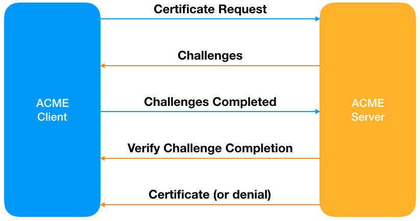
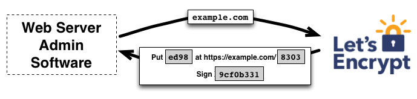

# Let's Encrypt: A Free, Automated, and Open Cerificate Authority by Josh Aas

SSL관련 자료를 찾다가 우연히 유튜브에서 [Let's Encrypt: A Free, Automated, and Open Cerificate Authority by Josh Aas]( https://www.youtube.com/watch?v=ksqTu7TX83g) 영상을 보게되었는데 내용이 너무 훌륭해서 보안에 관심 있는 사람이라면 누구나 한 번쯤 다 접해보길 바라는 마음에 포스팅을 작성하게 됐다.

영상에 사용된 원문과 그에 따른 해석 + 주석을 함께 덧붙여 내용에 대해 이해를 더 잘 할 수 있게끔 노력했다.

### What is HTTPS (HTTPS는 무엇인가?)

HTTPS is HTTP over a connection secured by TLS (used to be called SSL).

기존의 HTTP통신에 SSL(Secure Socket Layer)를 추가한 것이 HTTPS다. HTTPS는 HTTP와는 다르게 통신하는 내용이 암호화되어 있어 통신 주체가 아닌 제 3자가 해당 내용을 엿보거나 통제하기 어렵게 되어있다.

### Why is HTTPS Important for Everyone? (왜 HTTPS가 모두에게 중요할까?)

**Users: **aren't in control of their data any more, Web is too complex. Need to treat everything as potentially sensitive.
유저는 자신의 데이터에 대한 통제권이 없다. 데이터를 통제한다는 건, 웹에 대한 정확한 이해와 그에 따른 대처를 적절히 하고 있다는 것인데 그러기엔 알아야 할 것이 너무 많고 복잡하다.

단순 웹페이지 접속 또한 쿠키 정보, 헤더 정보, 써드 파티 앱과의 통신 등 우리와 연관된 너무 많은 정보들이 매우 빠른 시간 안에 네트워크를 거쳐간다. 이 모든 것에 대해 알고 있고 통제한다는 건 불가능에 가깝다. 기술을 잘 아는 사람도 마찬가지다.

그래서 일단 모든 정보는 민감한 정보이며 반드시 암호화되어 보호받을 필요가 있다라고 생각하는 마인드를 갖는 것이 첫번째로 해야하는 일이다. 중요한 정보, 보호받아야 할 정보를 선별적으로 관리하는 것이 오히려 더 많은 수고로움을 요구한다. 그냥 다 보호하자고 생각하는 것이 좀 더 합리적이라 생각하지 않는가?

**Developers:** expect integrity. Unencrypted traffic can be modified, e.g. ad insertion, script injection (e.g. great cannon).

네트워크에 흘러다니는 정보들이 암호화되어 있지 않다면, 누구나 다 열람해서 확인해볼 수 있다면 그건 개발자한테도 엄청나게 거슬리는 일이다. 

일례로 내가 운영하는 웹사이트가 있고, 사이트 방문자에게 "A"라는 알파벳만 보여주게끔 만들었다고 가정해보자. 사이트를 개발한 나는 사이트 방문자에게 "A"라는 알파벳이 보일 거라 기대하지만, 중간에 악의적인 공격자가 해당 네트워크 트래픽을 보고 광고를 끼워넣는다거나 "A"가 아닌 "ABC"로 내용을 바꿔서 사이트 방문자에게 전달하거나, 야한 사진 등을 넣어서 전달할 수도 있다. 

사이트 방문자는 이런 사실에 대해 알 수도 없고, 일일이 알아보는 것도 귀찮기 때문에 당연 사이트 운영자, 개발자를 욕할 것이다. 

### Important for you? (자신에게 물어봐야 할 필수질문들)

* How many of you believe that your cell phone provider actively mines data from your unencrypted Web traffic?
  스마트폰 제조회사가 당신의 데이터(웹 트래픽 중 암호화되지 않아서 몰래 훔쳐볼 수 있는 데이터)를 훔쳐보거나 따로 사익을 위해 사용하지 않는다는 걸 100% 믿습니까?
* How about your home ISP(Internet Service Provider)?
  우리가 사용하는 통신회사 KT, SKT, LG 등 인터넷 서비스 제공자를 얼마나 믿나요? 그들은 우리가 사용하는 데이터를 훔쳐보거나 빼가거나 하지 않을까요?
* How about your government?
  정부를 믿나요?

보안이 왜 중요한지를 생각해볼 수 있는 대목이다. 실제로 인터넷 서비스 제공자들과 정부는 우리의 웹 활동 중 일부를 감시한다. 대표적으로 불법 사이트 접속을 막는다. 한 번쯤 파란 경찰 마크와 함께 해당 불법 사이트 차단 이미지를 봤을 거라 생각한다. 요즘에는 인터넷으로 접속 자체가 안된다.

"불법 사이트를 차단해주다니..! 정말 건전하고 바람직해"라고 생각할 수도 있지만, 다른 말로 "우리는 매 활동을 검열당하고 있어ㅋ. 감시 당하고 있다고!"라고 생각할 수도 있다. 통제의 단계가 약할 뿐이지, 언제든 더 강한 강도로 우린 억압받을 수 있고 그럴 환경은 이미 갖추어져있다.

### The Web Isn't Secure (웹, 인터넷은 안전하지 않다.)

As of August 2016, only 45.5% of Firefox page loads are HTTPS. Should be 100%. 

2016년 8월 파이어 폭스 브라우저 기준으로, 파이어 폭스를 거친 웹사이트들 중 45.5%만 HTTPS통신을 구현했다. 너무 적은 수치이고 반드시 100%가 되어야 한다. 안전한 인터넷 활동을 위해서.

### Why Isn't the Web Secure? (왜 웹은 안전하지 않을까?)

Security is too difficult. 

We know what needs to be done but we haven't made it easy enough to do.

Unitl now? More on that later...

세상에는 널리 알려져있고 실제로 매우 유용한 암호화 방법론과 인증 관련 방법론이 다수 나와있다. 그런데도 왜 웹은 아직까지도 안전하지 않을까?

그 이유는 바로 보안 자체가 상당히 어렵고 까다로운 분야이기 때문이다. 적절히 설정하고 사용하는 과정에 대한 진입장벽도 높고 비용(비용이란 결국 보안을 달성하기 위한 인건비 혹은 의뢰비 등을 의미한다.)도 비싸다. 오늘 발표에서는 어떻게하면 그 과정을 쉽게할 수 있을지에 대해 나누고자 한다.

### Secure Connection Requirements

1. Encryption (scrambled bits)
2. Authentication (who am I talking to?)

우리가 안전한 통신을 제대로 사용하기 위해서는 2가지 요구사항이 존재한다.

첫번째는 암호화다. 내가 상대방에게 "여기 너가 원하는 데이터!"라고 직관적으로 주는 것이 아니라 "ㄴㅇ랴ㅐㅈ더갸ㅐㅈ갭ㄱㅂ"와 같이 암호화를 해서 준다는 뜻이다. 우리는 이렇게 해석하기 어려운 데이터를 원하는 상대에게 전송하면서 "내가 방금 사용자에게 전송한 데이터는 중간에서 가로챈다해도 해석하기 어렵고 뭔 소린지 모를껄?ㅋ 굉장히 안전하군!"이라고 생각할 수 있다.

두번째는 인증이다. 암호문을 받았는데 적절한 해석방법도 모르고 누구랑 통신하는지도 모르면 해당 암호문을 제대로 해석할 수 없다. 따라서 특별한 인증과정이 별도로 필요한 것이고 그 인증과정을 통해 "상대방이 내가 통신하려는 사람이 맞구나!"라고 안심하고 통신할 수 있는 것이다.

### Encryption (easy-ish)

Just a software stack for public key and symmetric crypto that needs to be installed and configured.

Most Web servers directly support it.

Protect your private keys.

암호화 자체는 기술적으로 어렵지 않고 이미 구현체가 많다. 대부분의 운영체제에서 자체 지원하고 있는 것들도 많고. 진짜 어려운 건 암호화된 데이터를 해석할 수 있는 아주 중요한 개인키를 어떻게 보호하느냐이다.

### Authentication via CA (too hard)

Certificate Authority issue the x.509 certificates required for SSL/TLS on the Web.

인증과정은 악몽 그자체다. 웹에서 인증을 구현하려면 인증서 관리국으로부터 인증서를 받아야한다. 똑똑한 것과 관련없이 누구에게나 굉장히 복잡하고 어렵다.

### Traditional Certificate Fun (인증서를 얻기 위한 전통적인 방법론, 매우 길고 짜증나고 고됨)

* Figure out you need a cert
  인증서가 필요하다고 생각한 우리가 고려해야할 건
* Try to figure out where to get a cert from
  **1: 어디서 인증서를 발급 받지?**
* Figure out what kind of cert you need
  **2: 어떤 종류의 인증서를 발급 받아야 하지?**
  주의: 많은 인증기관들에서 제공하는 다양한 종류의 인증서를 훑어봐야되고 온갖 마케팅 광고에 노출되어 심신이 피폐해질 수 있음. 알아보는 사람이 있다면... 무운을 빈다.
* Figure out how to request a cert (learn what a CSR is and how you make one)
  **3: 인증받고자 하는 인증기관에서는 당신에게 CSR을 요구할 것이야.**
  주의: CSR은 이해하는데 굉장히 오래걸리는 개념이고... 우리에겐 할 일은 많고... 당장 중요한 것이 앞에 쌓여있고.... 꼭 이럴 필요가 있을까라는 생각이들 수 있음.
* Go through painful manual verification process, maybe set up a new email address
  **4: 수동으로 인증 절차를 거쳐야하는데... 이메일 등도 설정해야 해.**
  주의: 매우 재미없고 의미없다고 느껴지는 과정이 될 수 있음.
* Pay
  **5: 인증기관에게 돈을 지불한다.**
  뭐, 개인이야 돈을 지불하는 건 상관없지만 만약 나같이 기업에서 일하는 개발자라면? 추가비용 지출을 위해 별도의 결재를 올려야하고 승인 받아야하고, 이 과정에 대해 별도의 설명을 해야하는 등... 매우 귀찮은 일이 기다리고 있을 것이다.
* Figure out how to install your cert
  **6: 서버에 인증서 설치하는 방법론을 또 살펴봐야 할 것이고**
* Remember to renew it on time
  **7: 갱신기간이 되면 제때 갱신해야한다.**
  관리포인트가 늘어났다. 맙소사.

### HTTP/2, Sumer 2012

HTTP/2 IETF WG debating requiring encryption. Major objection was that encryption was too hard or even impossible for many.

Josh Aas and Eric Rescorla decide we need to address this problem if the Web is ever going to achieve HTTPS Everywhere.

데이터를 암호화해서 보호하는 게 중요하다는 것에 모두가 동의하지만... 현실적으로 웹을 이용하는 사람 모두가 HTTPS를 인지하고 사용한다는 건 매우 매우 매우 어렵다. 논의되고 있는 HTTP/2의 보안 스펙은 TLS보안을 필수로 넣지 않는 쪽으로 논의되었다고 한다. 실질적으로 모두가 TLS를 적용한 HTTPS를 적용하기엔 비용도 너무 많이 들기 때문이다. 올바른 방법론은 뻔히 있는데 현실적인 제약으로 그러지 못한다는 건 너무나도 슬픈 일이다.

이런 문제들을 해결하기 위해 많은 고민을 거듭한 결과...

### The Solution

We needed a new CA. A lot of work, but nothing short of that would cut it.

Didn't think we could get an existing CA to fully cooperate. Especially on the time scale we wanted. Also, didn't want to be forever at the mercy of another CA.

결국 새로운 CA(인증기관)을 만들기로 했다.

현존하는 인증기관들에게 협력을 구하는 것도 어려울 것 같고... 협력을 한다해도 그게 오래 지속될지도 모르는 일이었다. 인증기관의 선심, 도덕성 등에만 맡길 수는 없는 노릇이었다.

### Cornerstones for a New CA (새로운 인증기관을 위한 초석)

**Automated**

Ease of use, reliability, and scalability
자동화로 인한 사용자 편의성 향상 (신뢰성과 확장성 또한 포함)

**Free**

Cost excludes, payment adds complexity

완전 무료로 이용가능하다. 결제하는 과정이 들어가면 복잡해지기밖에 더해?

**Transparent / Open**

Essential for trust

투명하고 열려있어서 신뢰할 수 있다. 현재 운영되는 CA들은 이용자들에게 모든 걸 세세하게 투명하게 공개하지 않는다.

**Global**

The secure Web is for everyone

안전한 웹 경험, 인터넷 경험은 소수의 것이 아닌 우리 모두의 것이 되어야 한다.

### Building a Foundation

Spent ~2 years (2013-2014) clearing schedules, creating an entity, finding initial sponsors, and making a plan for getting trusted (a deal with an existing CA).

위와 같은 것들을 달성하기 위해 2년 정도를 할애해서 스폰서들을 구했다. CA로서 신뢰를 얻고 싶다면 자기 자신에 대해 개인키를 생성하고 해당 키가 정합한 것인지를 증명하는 과정을 거쳐야하는데, 이를 위해서는 모든 브라우저들과 세상에 존재하는 핵심 서비스들에 전파되고 알려져야하는데 그러기 위한 시간이 약 5~10년 정도는 걸릴 것이라 생각했다.

따라서 어쩔 수 없이 스폰서 중에는 현존하는 CA를 두어 우리가 CA로서 적합하다는 것을 증명하는데 힘을 실었다.

### Internet Security Research Group

ISRG is the entity behind Let's Encrypt.

* Founded May 2013
* IRS 501(c)(3) status granted June 2014

Mission is to reduce financial, technological, and education barriers to secure communication over the Internet.

인터넷 연구 그룹으로부터의 지원도 받고 있고, 연구 그룹의 미션은 모든 사람이 인터넷에서의 안전한 통신을 누릴 수 있게끔 경제적 장벽, 교육적 장벽, 기술적 장벽을 허무는 것이다.

### The Linux Foundation

Let's Encrypt became an LF collaborative project in April of 2015.

The Linux Foundation's organizational development support has allowed us to focus on our technical operations.

리눅스 재단의 지원 또한 받을 수 있게 되었고 이제는 공동 프로젝트로 진행하게 되었다.

### Building Let's Encrypt

Announced to the public in November 2014. Work still to complete:

* Creating CA policy
* Writing software
* Ordering and installing hardware
* Configuring environment
* Hiring a team
* Making things as secure as possible
* Ensuring compliance, going thorugh audits
* Getting more sponsors

### How Let's Encrypt Works

* ACME Protocol, "DHCP for Certificates"
  자동으로 인증서를 받을 수 있는 프로토콜
* Boulder CA software implements ACME, running on Let's Encrypt infrastructure
  서버사이드 프로토콜로 깃허브에서 바로 확인해볼 수 있다.
* Clients request certificates from Let's Encrypt via ACME

### API Infrastructure

* ~42 rack units of hardware between two highly secure sites
* HSMs, compute, storage, switches, firewalls
* Lots of physical and logical redundancy
* Linux is our primary operating system
* Heavy use of config mgmt, almost everything automated
* API and OCSP go through Akamai

### Types of Certificates

* **Domain Validation (DV):** asserts control of a domain (what Let's Encrypt does)
  Sorts control of a domain and ties that to a public key, so basically says "this is the public key for the domain that you're trying to talk to you."
  
  If you encrypt with this public key, the idea is that this domain is the only domain that I'll be able to decrypt.
  도메인을 통제하고 있다는 것을 공개키를 통해 입증한다. "너가 지금 소통하고 있는 도메인에 대한 공개키가 바로 여깄어!"라고 말하는 것이다. 사이트 소유주 혹은 관리인이 공개키로 암호화를 하면, 이 도메인은 유일하게 내가 복호화할 수 있는 것인 것. 뭔 소리인지는 잠시 뒤에 입증.
  
* **Organization Validation (OV):** asserts control of a domain as well as basic organizational vetting
  DV랑 비슷하지만 name of an entity를 포함한다는 점이 다르다. 
  
* **Extended Validation (EV):** asserts control of a domain as well as extended organizational vetting
  OV랑 비슷하고 entity에 대한 더 많은 정보를 요구한다.

LE는 오직 DV만 발행하는데, DV만이 유일하게 자동화될 수 있기 때문이다. 조직차원의 엔티티를 자동으로 증명할 수 있는 방법은 없다. 그러나 ACME를 사용하면 도메인에 대한 통제권을 확인하는 과정을 자동화할 수 있다. 자동화할 수 있다는 건, 수많은 DV를 발행할 수 있다는 뜻이기도 하다. 우리가 서비스를 원하는 스케일을 감당할 수 있는 건 DV뿐이다.

### ACME Issuance Overview

1. 클라이언트가 Lets Encrypt 서버에 "인증서 발행해주세요!" 요청을 한다.
2. "You need to demonstrate these things"
   "You need to complete these challenges in order to get a cert"
   서버는 클라이언트에게 도전과제들을 준다. 인증서를 얻기 위해서 클라이언트는 서버가 주는 과제들을 잘 수행해야 한다.
3. 클라이언트는 과제들을 마친 뒤에 Lets Encrypt 서버에게 "과제 다 마쳤으니 와서 검사해봐"라고 메시지를 보낸다.
4. LE서버는 "오케이. 너가 우리가 준 과제들을 잘 수행했는지 확인해볼게."
5. 확인이 되었다면 인증서를 발행해주고 그게 아니라면 거절한다.

### ACME Challenge Types

* **HTTP: Put a file on your web server**
  This is where we give you a special file we tell you to put it at a special place or on this particular path on your web server and then we pick a path that is not likely to be in use for other things and the file is not a file that's likely to be already on your web server anywhere, so if  you demonstrate to us that you can place this special file at a particular predetermined location in your server that's a demonstration of control.

* **DVSNI: Provision a virtual host at your domain's IP address**
  가장 적게 쓰이는 옵션이지만 특정 상황에서는 꽤 괜찮은 과제이다.
  we ask you to essentially provision a virtual host that your domain IP address in such a way that it demonstartes proper control. 

* **DNS: Provision a DNS record for your domain**

  The thrid way is DNS validation and it's a lot like HTTP validation but instead of putting a file on your server you can think of it as taking that file and sticking it in a DNS record because if you can control if you can demontsrate control of DNS for your domain then we're gonna with just assuming that you can contorl the server because you can point DNS wherever you want. DNS is fairly popular and I believe it's growing becase DNS is the only challenge that dosen't require us to actually contact your server for verification so sometime people for example I have an internal web server that's not on the public web but they have a publicly resolvable DNS record they can use the DNS challenge and prove control over the server without having Let's encrypt actually go back to ther server and talk to it to check for a file. DNS is also used a lot for devices which we'll talk about a little later.

### Clients

Basically 3 categories of clients:

1. Simple (drop a cert in the current dir)
2. Full-featured (configure server for you)
3. Built-in (web server just does it)

Built-in is the best client expereience!

### Devices

Many of our cerificates are going to devices for management interfaces.

Synology is a great example. One click and your NAS system is using publicly trusted PKI for management.

Have been talking to other device makers, routers in particular, a lot more of this is coming.

### 90 Day Cert Lifetimes

Shorter lifetimes are important for security.

* Encourage automation
* Limit damage from key compromise or mis-issuance (revocation dosen't work)

Short-lived certs some day? Potentially a nice solution for revocation.

재발급이 좋지 않은 이유는 크롬같은 브라우저에서는 매번 인증서를 새로 받아오거나 확인하는 일을 하지 않기 때문이다. 이전에 확인해둔 인증서가 있다면 해당 정보를 표시해주는 형태다.

### Phishing and Malware

CAs are not the right place to police phishing and malware.

* Don't have the data
* Can't respond fast enough
* If HTTTPS becomes existential, we don't want to be censors
* Revocation is ineffective

Read our full blog post about this.

구글에서 운영하는 위협데이터베이스와 비교하여 적절치 않은 도메인이라 판단되면 해당 도메인에 대해 인증서는 발행해주지 않는다.

### Certificate Transparency

CT is an important part of improving the PKI ecosystem 

## Documentation

### How It works

두 단계로 설명할 수 있다.

1. certificate management agent가 CA에게 웹서버가 도메인을 통제하고 있다는 걸 증명한다. 
2. 그러고 나면 agent는 해당 도메인에 대해 인증서를 요청, 갱신 그리고 재발급할 수 있다.

#### Domain Validation

Let's Encrypt는 서버 관리자를 인식할 때 공개키로 한다. agent 소프트웨어가 LE랑 통신할 때, agent는 새로운 키쌍을 생성하고 LE CA에게 서버가 한 개 이상의 도메인을 통제하고 있다는 것을 증명한다. 이러한 과정은 계정을 생성하고 해당 계정에 도메인을 더하는 기존 CA 프로세스와 유사하다.

agent는 LE CA에게 도메인을 통제하고 있다는 걸 증명하기 위해서는 어떤 절차가 필요한지를 묻는다. LE CA는 요청 받은 도메인 이름을 살펴보고 하나 이상의 도전과제들을 준비한다. 각각 다른 문제들이 주어지는데 예를 들어, CA는 agent에게 아래와 같은 선택지를 줄 수 있다.

* 도메인에 대한 DNS 레코드를 생성
* 도메인의 알려진 URI에 HTTP 자원을 생성

도전과제와 함께 LE CA는 논스값을 제공하는데, agent는 반드시 개인키쌍으로 서명해서 키쌍을 갖고 있다는 것을 증명해야 한다.

agent는 도전과제 중 하나를 완료한다. 알려진 URI에 자원을 생성하는 것을 달성했다고 해보자. 특정 경로에 파일을 생성하는 과제 말이다. agent는 또한 제공받은 논스를 개인키로 서명한다. agent가 이러한 과정들을 완수하면, CA에게 "검증 ㄱㄱ"하라고 알린다.

CA는 과제를 잘 완수했는지를 확인한다. CA는 논스에 대한 서명을 검증하고, 특정 파일을 해당 웹서버에서 다운로드 받는다. 그리고 다운로드 받은 파일의 내용이 기대했던 내용인지 확인한다.

만약 논스에 대한 서명이 유효하다면 과제를 잘 통과한 것이고 공개키로 식별되는 agent는 도메인에 대한 인증서 관리를 할 수 있게 된다. agent가 사용하는 키 쌍은 도메인에 대한 "authorized key pair"로 부른다.

#### Certificate Issuance and Revocation

일단 agent가 authorized key pair를 가지면 인증서를 요청, 갱신, 그리고 삭제하는 건 간단하다. 인증서 관리 메시지만 전송하고 해당 메시지를 authorized key pair로 서명하면 된다.

LE CA가 요청을 받으면, 두 개의 서명을 모두 검증하고 모두 괜찮다면, 해당 도메인에 대한 인증서를 CSR에 있는 공개키와 함께 발행하고 agent에게 전해준다.

재발행도 비슷한 방법으로 동작한다. agent는 특정 도메인에 대해 권한이 있는 키쌍으로 재발행 요청을 서명한다. 그리고 LE CA는 요청이 authorized인지 확인하고, 맞다면 재발행 정보를 normal revocation channels (i.e. OCSP)에 발행한다. 그러면 브라우저들과 같이 연관있는 주체들이 폐기된 인증서는 받아들이지 않고 그 인증서를 폐기처분한다.

