# 2강 

## 2장을 들어가기 앞서 

2장의 내용은 전에 1장에서 간단하게 배운 **System Call**에 대해 더 자세히 다룰 것 이다. System Call이란 멀티유저 시스템에서 한 프로세스가 다른 프로세스에 I/O로 함부로 접근해 데이터를 망치는 일을 사전방지\(Prevent\)하기 위해 나온 방법이다.  정리해보면 쉘이 I/O를 사용하려고 하는 순간 커널은 CPU를 빼았는다. **I/O를 하고 싶으면 커널이 가지고 있는 function에 부탁해**라는 매커니즘을 System Call이라 하고 우리는 이 내용을 1장에서 배웠다. 이번 2장에서는 System Call의 구체적인 동작 방식을 살펴본다.

## 1. 시스템 콜(System Call)

---

**시스템 콜(System Call)은 것은 정확히 언제 일어나는 것일까?** 우리가 I/O관련 function을 하려고 하면 그때 바로 일어나는 것일까? 이것을 알아보기 위해 먼저 밑에 그림을 보자.

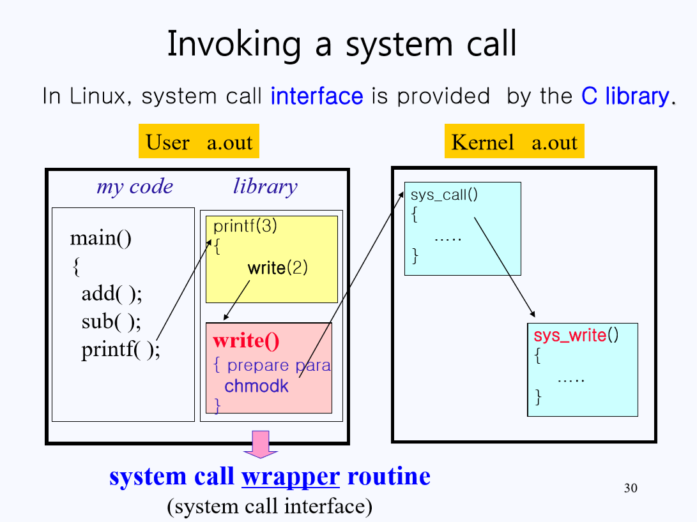

> 리눅스 명령어는 옆에 붙은 숫자에 따라 **커맨드(1), 시스템 콜(2), 라이브러리 함수(3)**로 구분된다.

위 그림의 좌측을 보면 유저 영역 안에 내가(유저)가 작성한 코드 `my code`가 있다. 이 코드에서 `printf()`를 호출(call) 하는데 이 `printf()` 코드는 내가 작성한 게 아니라 `library function`이다. C언어를 배울 때 `#include <stdio.h>`를  하는 이유를 생각해보면 금방 이해할 것이다. 그럼 이제 `printf()`가 내가 작성한 코드 `my code`에 들어오는데 `printf()`는 출력 즉, I/O를 해 줘야 한다. 1장에서 배웠듯, 멀티 유저 시스템에서 I/O는 오직 커널만 할 수 있기 때문에 **I/O를 하는 모든 library function은 무조건 System Call을 사용해야 한다. 커널에게 부탁한다는 뜻이다.**

시스템 콜을 하게 되면 **Wrapper Routine**이라는 공간에 가게 되고 이 공간에는 왜 커널로 가게 되는지 알려주는 정보들을 담고 있는 **Prepare parameter**와 CPU의 모드 비트를 커널로 바꾸는 **chmodk**가 들어있다.

**chmodk**가 실행되면서 프로그램은 런타임 중 트랩에 걸려 커널 영역으로 가게 된다. 커널에서는 `Prepare parameter`에 담겨있는 내용을 보고 적절한 **System call function**으로 처리를 해준다.

> 커널 안에 있는**모든 System call function의 이름은 `sys_`로 시작**한다. 리눅스의 naming convention(명명 규칙)이니 알아두길 바란다.

### 1.1 Wrapper Routine 

트랩으로 넘어갈 내용들을 준비하고 실질적으로 트랩을 일으키는 공간인 `Wrapper Routine`에 대해 조금 더 알아보자

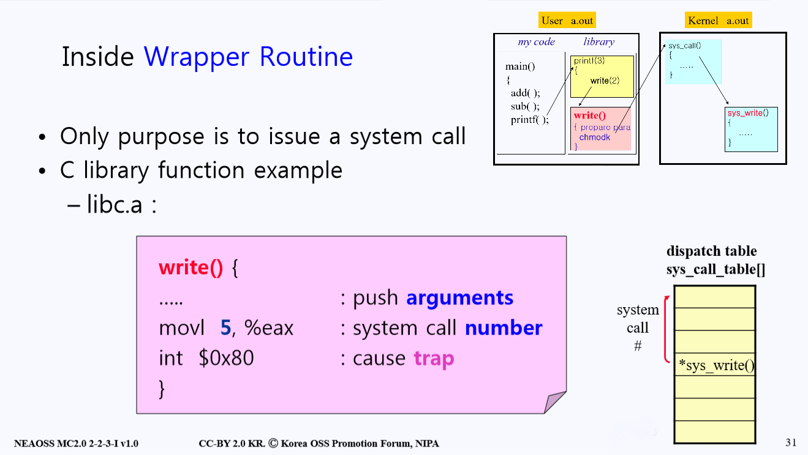

`Wrapper Routine`에서 (인텔의 경우) `$0x80`등 의미 없는 문자들을 이용해 Machine Instruction을 주어 트랩을 발동한다. 그런데 위에서 트랩을 일으키기 전에 `Prepare parameter`들을 준비하게 되는데 그 중에 가장 중요한 것은 바로 **system call number**라는 것이다. 이 `system call number`는 커널이 가지고 있는 **system call function의 시작 주소를 담고있는 Array(배열)의 Index 번호**로 사용이 된다.

`system call number`의 예를 들어 보면 다음과 같다. `file`과 관련된 `system call`에는 `open, close, read, write `등이 있는데 open은 0번, close는 2번, read는 3, write는 4번 등 call number을 이용해 Array의 Index 위치에 접근을 한다.

지금까지의 과정을 순차적으로 정리해 보면 아래와 같다.

1. 컴파일러\(gcc\)가 유저가 짠 코드를 보고 라이브러리(`printf()`)를 호출한다.
2. 라이브러리에서 시스템 콜(`write`)을 호출한다. 위 그림의 write(2)의 2는 시스템 콜을 의미하는 숫자일 뿐 매개변수와 같은 의미는 없다.
3. Wrapper Routine에서 `write`에 대응하는 `system call number`가 나오고 트랩을 건다.
4. 커널이 `system call number`을 가지고 `system call function table`에 접근해 `function`의 시작 주소에 접근한다.

> 여기서 하나 알아둬야 할 점은 이렇게 `system call number`를 지정한 컴파일러와 그 `system call number`를 받고 `system call function table`에서 `function`을 찾는 운영체제의 번호가 **서로 일치해야 한다는 점이다.** 이러한 번호들은 컴파일러를 쓰는 **회사에서 결정**을 한다. 실례로 만약 다른 회사의 플랫폼으로 시스템을 옮기면 소스파일들을 다시 컴파일을 해줘야 `system call number`가 얽혀서 오동작하는 오류를 방지할 수 있다.

마지막으로 아래 그림에 나온 예시를 통해 시스템 콜의 과정을 자세히 살펴보자.

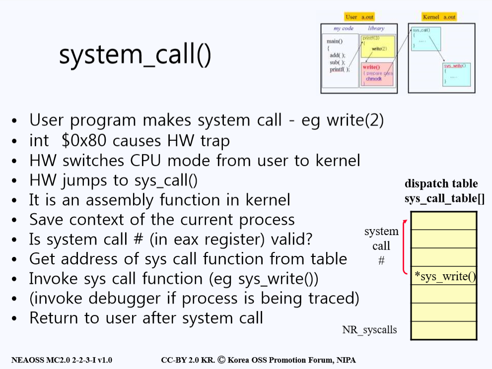

* 유저 프로그램이 시스템 콜을 호출한다.
* Machine Instruction이 트랩을 발동한다.
* 하드웨어가 유저 모드에서 커널 모드로 `mode bit`를 바꾼다.
* 하드웨어가 `sys_call()`이라는 커널안의 트랩 핸들러(Trap Handler)로 가게 된다.
* 이런 핸들러는 커널안의 `assembly function`을 수행한다.
* 지금까지 유저 프로그램에서 진행했던 단계를 저장을 한다. (커널 쪽 일이 다 끝나면 시스템 콜을 호출 했던 곳으로 돌아가서 다시 진행을 해야하기 때문에 저장하는 것이다.)
* 시스템 콜 번호가 커널 안에 `sys_call table`에 있는 번호에 맞는 번호인지 확인한다.
* 맞다면 `system call function`의 주소를 가져온다.
* 그리고 `system call function`을 불러 작업한다.
* (만약 진행 과정 중 디버깅이 필요하다면 디버거를 실행시킨다.)
* 다시 시스템 콜 호출했던 유저의 영역으로 돌아가고 mode bit를 유저 모드로 전환한다.

### 1.2 Kenrel System Call Function 

스마트폰 어플리케이션으로 찍은 사진을 볼 수 있는 갤러리 어플리케이션을 만들었다고 생각해보자. 갤러리 어플은 사용자가 자신이 촬영하여 폰에 저장한 사진을 볼 수 있게끔 해준다. 

어플리케이션을 제작할 때 소스코드에는 분명 스마트폰에 저장된 사진을 읽어오는 기능이 있을 것이다. 이 기능은 `library`함수를 사용하여 구현했을 것이고, 실제 동작할 때  `library`는 I/O를 하기위해 System Call을 호출할 것이다. 커널에게 부탁한다는 매커니즘이 시스템 콜이라는 점을 다시한 번 떠올리자. 

> 별도의 함수를 만들어서 스마트폰에 저장된 파일을 읽어오는 것보다는 라이브러리로 구현된 소스코드를 사용하는 것이 훨씬 효율적이다. 만약 코드를 직접 만든다고 해도 시스템 콜을 적절히 배합해서 원하는 동작을 하게끔 구현해야하는데 굳이 이렇게 할 필요가...

커널에서는 유저가 원하는 사진 파일을 시스템 콜을 호출한 유저 영역으로 넘겨줘야 할 것이다. 때로는 커널이 유저 영역으로부터 데이터를 가져와야 하는 경우도 있을 것이다. 즉 어플리케이션이 제대로 동작하기 위해서는 유저 프로그램과 커널 프로그램이라는 서로 독립된 프로그램 사이에 데이터를 주고 받을 수 있는 수단이 반드시 필요하다.

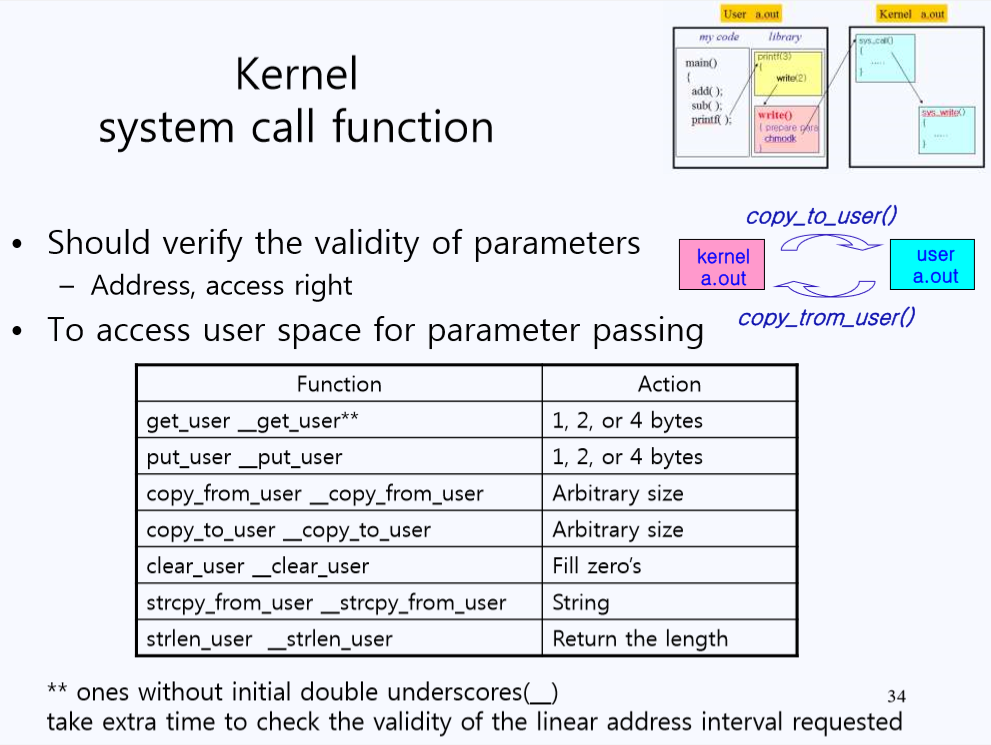

**그러한 기능들은 오직 커널만이 가지고 있다.** 리눅스는 멀티 유저 시스템이고 시스템의 보안을 위해서 오직 커널만이 모든 메모리에 접근이 가능하다. 좀 더 자세히 살펴보면, 커널이 유저에게 데이터를 보내줄 수는 있어도 **유저가 커널로부터 데이터를 읽어 올 수는 없고** 커널이 유저한테서 데이터를 읽어올 수는 있어도 **유저가 커널한테 데이터를 보낼 수는 없다.** 모든 I/O는 커널을 통해서만이 이루어 진다.

> 이쯤 되면 유저는 거의 커널의 노예라고 할 수 있다. 모든 중요한 행위는 커널에게 부탁해야한다. 감히 컴퓨터에 직접적으로 데이터를 쓴다거나 읽어온다든가 하는 행위는 절대 할 수 없다. 
>
> 유저가 요청하는 데이터의 바이트의 수는 커널이 디스크에서 받아오는 것처럼 일정한 바이트의 단위가 아닌 4바이트, 7바이트 등 여러가지가 될 수 있기 때문에 커널에는 유저가 원하는 바이트 만큼 넘겨주는 기능 등이 존재한다.

### 1.3 System Call Number 

그럼 커널에 대해 더 자세히 알아보기에 앞서 트랩전에 정해지는 시스템 콜 번호에 대해 구체적으로 알아보고 가자

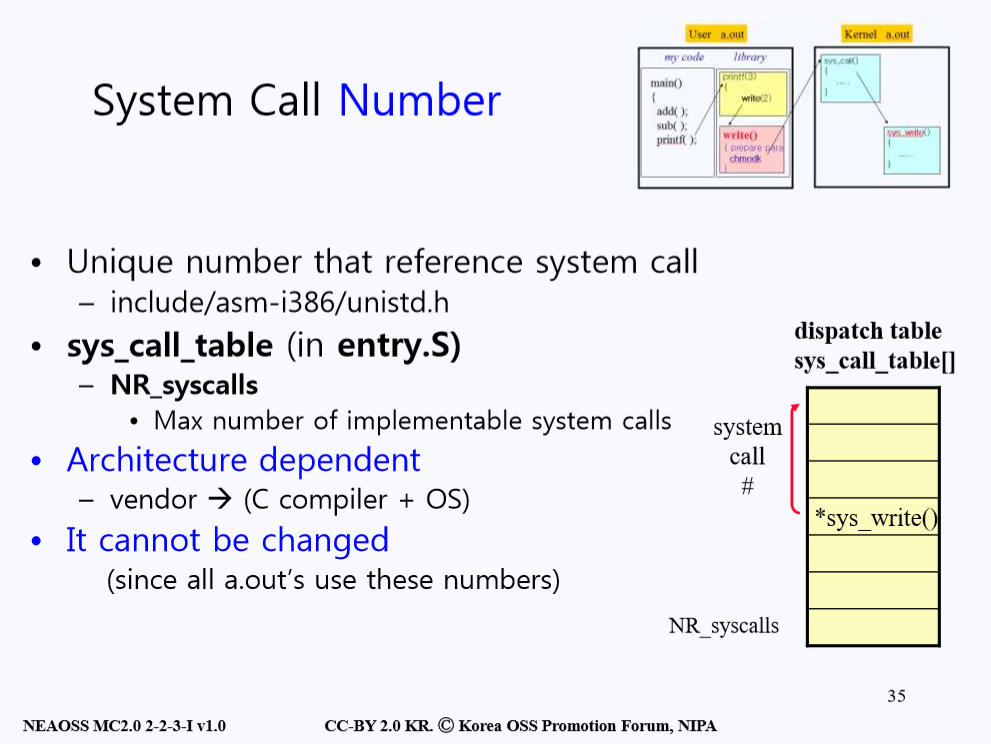

`System call number`는 커널의 `system call table`의 인덱스 번호로 사용되어 `system call function`의 주소의 시작값을 불러오는 용도로 사용된다. `System call number`는 컴파일러와 OS를 제작한 회사에서 정하며 이렇게 정해진 번호는 변경 할 수 없다.

그렇다면 리눅스에 자신만의 `시스템 콜(System Call)`을 만들 수는 없을까? `sys_write()`나` sys_read()`처럼 내가 특정 기능 수행하는 시스템 콜을 정의하고 사용할 순 없을까? 물론 직접 만들 수 있다!

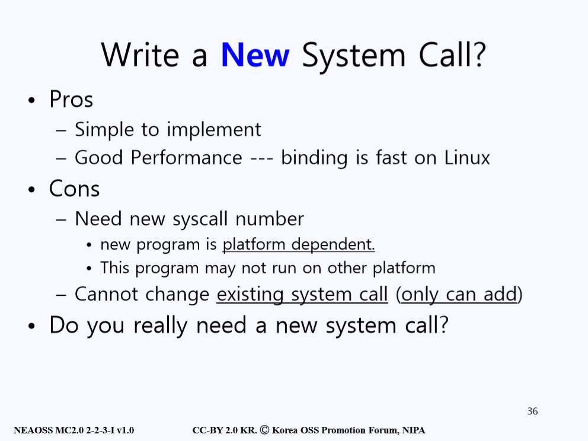

시스템 콜을 만들기 전에 먼저 새로운 시스템 콜을 만드는 것의 장점을 살펴보자. 우리는 새로운 시스템 콜을 만들 때 우리가 원하는 특정 기능만을 위한 코드를 작성할 수 있다. 즉 기존에 존재하는 시스템 콜 보다 간단하고 성능 또한 좋게 만들 수 있다.

> 예를 들어, 여러분은 컴퓨터 화면에 특정 알파벳만을 출력하는 기능을 새로 정의할 수 있을 것이고 이는 알파벳 뿐만 아니라 숫자, 기호 등을 출력해줄 수 있는 기존의 `printf()` 함수보다 훨씬 코드도 간결하고 효율적일 것이다.

분명 시스템 콜을 직접 만들어 사용하면 성능도 좋고 기존 시스템 콜보다 간결할 수 있다는 장점이 존재하지만 이보다 훨씬 큰 단점이 존재한다. 새로운 시스템 콜을 만들게 되면, 그 시스템 콜만의 새로운 `system call number`가 필요하게 된다. 

이렇게 새로 제작할 때마다 `system call number`를 정의하게 되면 새로만든 시스템 콜은 그것을 제작한 플랫폼에서만 사용할 수 있다. 즉 다른 플랫폼에서 본인이 만든 시스템 콜(예를 들어 99번)을 호출하는 것은 불가능하다. 다른 플랫폼에는 99번에 해당하는 시스템 콜이 존재하지 않거나 다른 시스템 콜일 수 있기 때문이다. **플랫폼 의존적**이라는 치명적인 단점 때문에 보통 시스템 콜을 직접 만들어서 사용하는 일은 거의 없다.

또한 한번 만든 시스템 콜은 **추가만 가능하고 변경은 불가능**하기 때문에 나중에 수정을 하는 것도 불가능하다. 그렇다면 새로운 시스템 콜은 만드는 건 아예 하지 말아야 할까? 다행히도 방법은 있다.

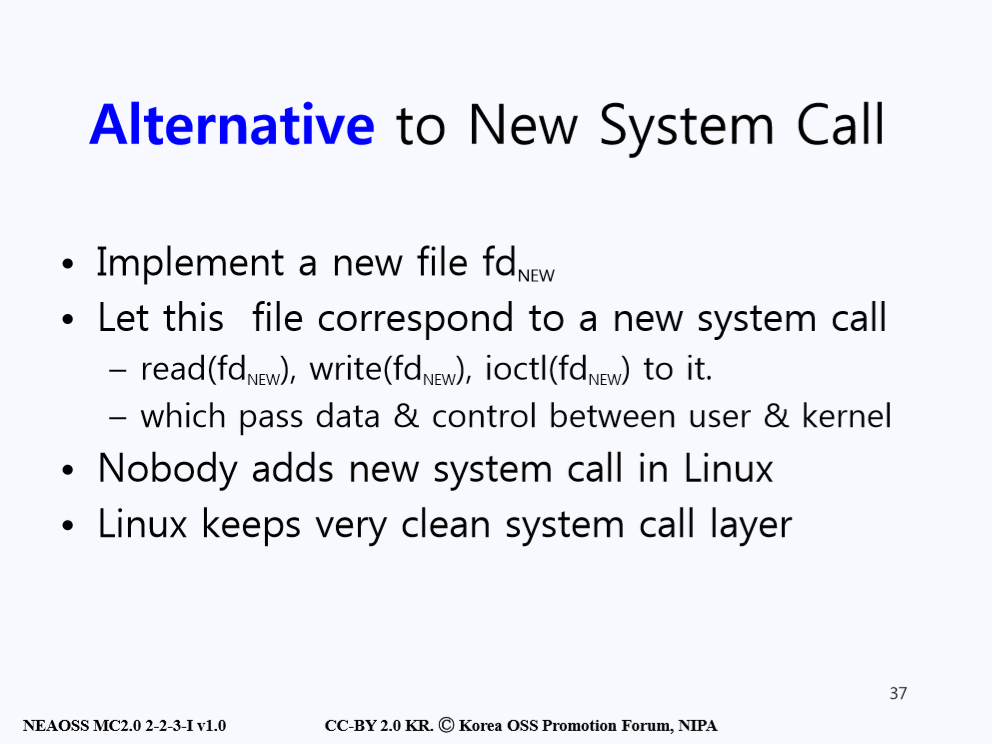

그 방법은 바로 기존에 있던 시스템 콜인 `read`나 `write`에 있는 **파일 디스크립터(File Descriptor)**을 활용하는 것이다. 파일 디스크립터는 뒤에 다루겠지만 먼저 간단히 설명을 하자면 **운영체제가 만든 파일이나 소켓을 편하게 부르기 위해서 부여한 숫자**이다.

파일 디스크립터는 보통 적은 숫자만이 활용이 되고 있어 보통은 잘 쓰지 않는 999번 등에 본인의 파일 디스크립터를 지정하고 사용하면 커널안에 내장된 시스템 콜에 영향을 주지 않고도 사용할 수 있다. 훨씬 안전한 방법이다.

`Robert M. Love`의 책에서도 권장하는 방식이고 전 세계 모든 유닉스 사용자들이 이러한 방식을 사용하고 있다고 한다.

## 2. Process Management 

시스템 콜에 대한 내용은 이 정도로 정리하고, **Process Management**에 대한 내용으로 넘어가자. Process Management는 커널이 하는 아주 중요한 임무 중 하나로서 반드시 짚고 넘어가야 할 부분 중 하나다.

### 2.1 OS Kernel 

1강에서 우리는 운영체제가 어떤 역할을 하는지를 배웠다. 운영체제는 **하드웨어 자원을 관리**하고 **프로그램들을 지원**해주는 역할을 한다.

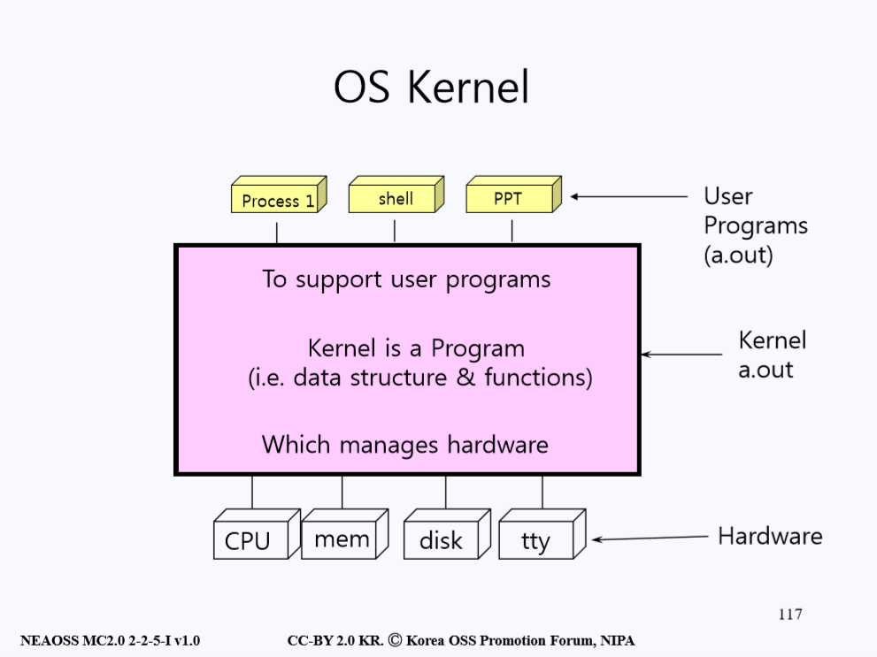

이와 마찬가지로 **운영체제의 핵심**인 커널 또한 같은 역할을 한다. 위 그림을 살펴보자. 커널은 위로는 프로그램들을 지원하고 밑으로는 하드웨어\(CPU, Memory, Disk, TTY\)를 관리하는 데이터와 기능들을 가지고 있는 프로그램이다. 

> 실제로 위 아래 개념이 존재하는 것은 아니고 유저 프로그램과 하드웨어의 중간다리 역할을 한다는 점을 보여주기 위해 그림과 설명이 저렇게 제공된 것이다.

효율적인 하드웨어 관리와 유저 프로그램을 지원하기 위해 커널은 자체적인 **Internal Data Structure**을 가지고 있다.

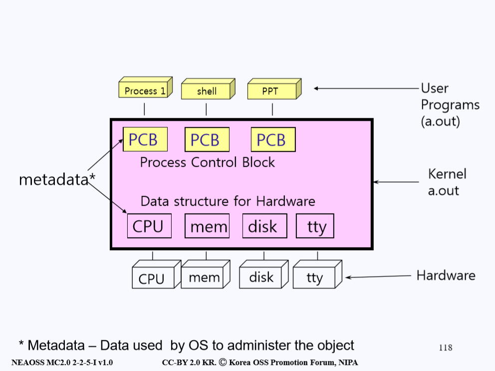

먼저 하드웨어 관리를 위한 **Data Structure**안에는 **각 하드웨어에 대한 정보**가 담겨있다. 예를 들어 Memory 하드웨어에 관한 Data Structure `mem`에는 이 **Memory의 크기가 어느정도이며 어디서부터 어디까지 메모리가 사용되고 있는지 등** 관리를 위해 필요한 내용들이 담겨있다.

하드웨어 뿐만 아니라 프로세스들을 관리하기 위한 Data Structure또한 존재한다. 우리는 이러한 Data Structure를 **PCB(Process Control Block)**이라 부른다. 즉 **프로세스를 지원하고 관리하기 위한 정보들이 담겨있는 데이터 구조체**이다.

위에서 설명한 프로세스와 하드웨어를 관리하기 위한 데이터가 담겨있는 데이터 구조체를 통틀어 **메타데이터(metadata)**라고 부른다.

> 컴퓨터공학을 공부하다보면 정말 많이 만나는 용어 중 하나가 메타데이터다. 데이터를 관리하기 위한 데이터라고 생각하면 이해가 편하다. 도서관에 수많은 책들이 존재하는데, 책들을 관리하기 위해서는 효율적인 전산 시스템이 필요하듯 메타데이터 또한 시스템에 있어 필수적인 요소다.

**그렇다면 프로세스를 관리하기 위한 metadata에는 어떤 정보들이 있을까?**

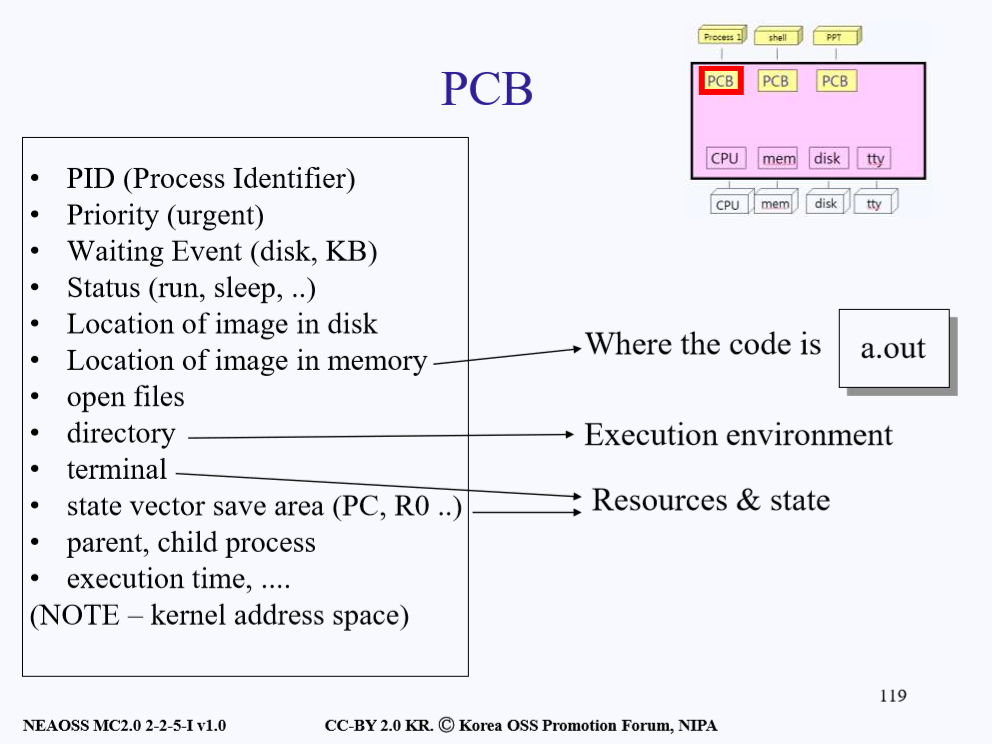

`metadata`에는 다음과 같은 내용등이 담겨있다.

* PID\(프로세스 식별자\)
* 프로세스의 우선순위
* 대기 현상 (디스크를 읽고 쓰는 등 입출력 작업에는 waiting이 일어난다.)
* 프로세스의 상태 (동작 중인지, 수면 중인지)
* 디스크 내 이미지의 위치
* 메모리 내 이미지의 위치(메모리 안에 코드가 저장되어 있는 위치)
* 열린 파일들(유닉스에서 **파일은 바이트의 연속이고 각종 디바이스 또한 전부 파일로 취급**한다. 참고로 **제일 먼저 오픈하는 파일은 키보드와 스크린 파일**이다.)
* 현재 프로세스가 실행되고 있는 환경에 대한 정보
* 터미널
* 상태 백터 저장 공간 (`state vector save area`라는 용어 자체에 친숙해지는 것이 좋다.)

> 만약 프로세스 A가 CPU를 점유하고 있다가 디스크에 용무가 생겨 디스크에게 갔는데 디스크가 먼저 들어 온 일을 처리하고 있었다면 기다림(waiting)을 신청하고 디스크가 작업을 끝내기를 기다린다. 인간 세계에서는 대기 시간이 고작 몇 초도 안걸리는 작업이라고 생각할 수 있지만 이 정도의 시간은 CPU 입장에서는 몇억, 몇 천억년의 시간이기에 A가 기다리는 동안 A가 점유하던 CPU를 다른 프로세스에게 주게 되는데 이때 **A가 하고 있던 작업 내용**을 **A의 PCB(Process Control Block)에 저장**을 한다. 
>
> 이때 **이 저장 공간을 state vector save area**라고 한다. **state vector save area**는 Register들을 저장하고 있는 공간이다. Register라는 건 **State of Flipflop**(0과 1)이 32개가 모여있는 집합이다. 프로세스의 상태들을 저장한다고 이해하면 된다.

* 부모, 자식 프로세스

* 실행 시간

**이처럼 metadata에는 프로세스와 하드웨어를 관리하는데 있어 필요한 모든 정보를 담고 있다.**

다음으로 `state vector save area`를 자세히 살펴보자. 먼저 앞서 예시로 들었던 **프로세스 A의 기다림(waiting) 신청**이라는 개념에 대해 자세히 설명하겠다. 도대체 기다린다는 건 뭐고 커널 내에서 어떻게 동작하는 걸까?

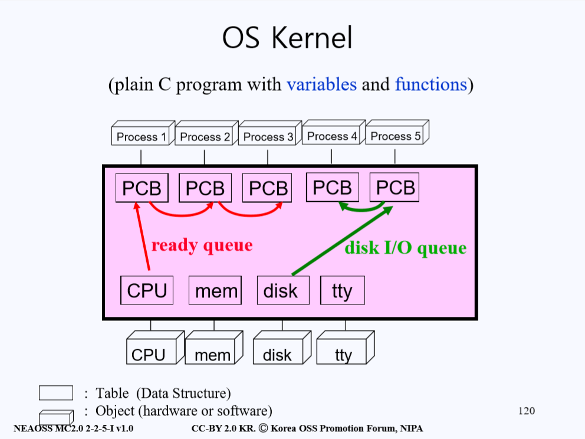

우리는 은행에 가서 일을 처리하려 할 때 이미 창구에 다른 사람이 먼저 일을 보고 있으면 **번호표**를 뽑고 기다린다. 이처럼 프로세스 또한 본인이 사용하고 싶은 하드웨어가 이미 다른 프로세스에 의해 사용되고 있으면 대기표를 뽑고 기다려야 한다. 

프로그램적으로 위 과정을 이해해보면 다음과 같다. **프로세스가 자신의 PCB에 사용하고 싶은 하드웨어에 대한 링크를 걸어놓고 Waiting Queue(대기열)에 들어가게 된다.** 만약 본인 앞에 다른 프로세스가 똑같은 하드웨어를 사용하려고 이미 `Waiting Queue`에 있는 상황이라면 먼저 기다리고 있던 프로세스의 뒷 순서로 `Waiting Queue`에 들어간다.

이런 `Waiting Queue`중 **CPU에 링크를 걸어놓고 기다리는 것을 ready queue**라고 **하고 디스크에 링크를 걸어놓고 기다리는 것을Disk I/O queue(또는 Disk wait queue)라고 한다.**

## 3. Child Process 생성하기

컴퓨터를 부팅하면 제일 먼저 **커널 프로세스**가 로드된다. 그리고 이 커널은 터미널이 켜질때 마다 그에 해당하는 **Shell**,  즉 **Child Process**를 만든다. Shell은 사용자의 입력을 기다리고 입력이 들어오면 그에 따른 작업을 수행해주는 프로그램이다. 사용자가 `Mail`이라고 입력하면 `Mail`이라는 `Child Process`가 생성 된다. 이처럼 프로세스들이 진행될 때는 자식 프로세스(Child Process)가 생성되면서 진행된다. 따라서 커널을 공부할 때 Child Process는 반드시 알아야하는 개념이다. 지금부터의 설명은 아래 그림과 함께 살펴보도록 한다.

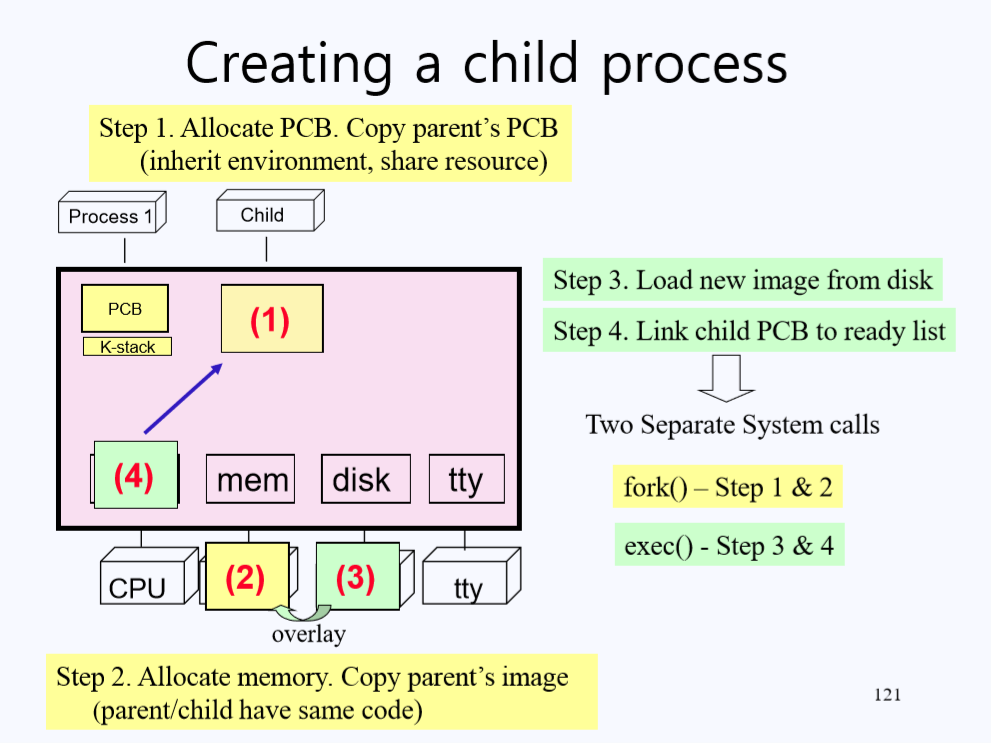

> 잠시 여기서 프로그램과 프로세스의 차이에 대해 알아보자. 프로그램과 프로세스의 차이는 명확하다. 프로그램은 보조 기억 장치에서 실행이 되기만을 기다리는 정적인 데이터의 집합이고, 프로그램이 명령어와 데이터와 함께 메모리에 적재되면 프로세스가 되는 것 이다. 즉, **프로세스란 실행 중인 프로그램을 뜻한다.**

1강에서 배웠듯 프로그램에는 `User Stack`과 `Kernel Stack`이 존재한다. `User Stack`은 프로그램에서 `function`을 사용할 때 사용된다. `Kernel Stack`은 유저 모드에서 시스템 콜을 통해 `커널의 function`들을 사용할 때 필요한 자료구조로 프로그램 실행에 필요한 Local Variable들을 저장하기 위한 공간이다. 만약 자료구조를 가변적인 Stack구조로 사용하지 않고 늘 공간을 확보해둔다면, 프로그램 크기가 엄청 커지고 운영 비용만 비싸질 것이다.

지금부터는 `Child Process`를 생성하기 위한 과정들을 살펴볼 것이다. `Child Process` 생성을 위해서는 먼저 Process의 정보가 들어있는 `PCB(Process Control Block)`를 만들고 그 PCB에 해당하는 Process를 만들어 줘야한다.

진행 순서는 아래와 같다.

1. **PCB 공간을 만들어 준다. **초기값으로 **Parent Process의 PCB를 복사**해온다. Parent가 사용하던 Resource(터미널, 키보드, 스크립트)를 자식 프로세스도 사용하게 되는 것이다. `Parent Process`의 실행 환경이 `Child Process`의 실행 환경이 된다.
2. `Child Process`가 들어갈 수 있는 메모리 공간을 확보하여 초기값을 지정한다. 이를 위해 커널은 Memory의 Data Structure에 가서 빈 메모리 공간을 찾아 공간을 지정해준다. 지정된 공간에 Child Process의 값들을 넣기 전에 먼저 `Parent Process`의 **image를 똑같이 복사**를 해준다. 이 이유는 후에 등장한다. 프로세스 처리과정을 간편화하기 위해 복사한다고 일단 기억해두자.
3. 디스크로부터 `Child Process`에 **새로운 image를 로드한다.**
4. 새로 생긴 `Child Process`의 `PCB`를 **CPU의 ready queue에 등록**하여 CPU를 사용 할 수 있게끔 준비해준다. \(아직까지 CPU는 `Parent Process`가 사용 중 이기 때문이다.\)

이러한 4가지 과정을 시스템 콜의 용어로 정리하면 **두가지**로 정리할 수 있는데,

1. 1번과 2번의 과정을 **Fork**라고 부른다. \(Parent와 동일한 것을 만든다.\)
2. 3번과 4번의 과정을 **Exec**이라고 부른다. \(디스크로 부터 새 이미지를 읽어온다.\)

### 3.1 Fork

일단 Fork(포크)에 대해 알아보기 전에 Fork는 **한번 호출하면 두번 리턴한다**라는 개념으로 기억하자. 지금은 이해가지 않더라도 일단 이 사실을 받아들이고 설명을 읽어보자.

두번의 리턴 중 첫번째 리턴은 `Parent Process`가 본인이 가지고 있는 Process 상태를 그대로 `Child Process`에 복사하고 CPU의 `ready queue`에 `Child Process`를 등록 시켜놓고 다시  `Parent Process`로 리턴하는 과정이다.

> 단순히 함수를 호출한 후 리턴해서 그 다음 실행흐름으로 위치했다는 의미다. 프로그램적으로 너무나도 당연한 과정이다.

그 후 `ready queue`에 등록되어 대기중이었던 `Child Process`가 CPU를 점유하게 된다. `Child Process`가 실행되는데, `Child Process`는 만들어질 당시  `Parent Process`와 동일한 `PCB(Process Control Block)` 즉, 같은 `State Vector`를 가지고 생성되었기 때문에 **Fork를 호출하고 난 바로 그 다음 진행 시점**에서 실행된다. 

즉 `Child Process`는 `Parent Process`가 가지고 있는 정보들 뿐만 아니라 **프로그램 진행 상황까지 완전히 똑같은 상태**를 가지게 되고 이런 현상 때문에 **Child Process 또한 Fork에서 리턴**하게 된다.

그렇기 때문에 한번 Fork를 해서 두번 돌아온다는 표현이 생긴 것 이다. 단, 운영체제가 이런 두 가지의 return으로 일어나는 혼동을 막기위해 리턴하는 값은 다르게 해준다. 지금까지 설명한 과정을 아래 그림과 함께 살펴보자.

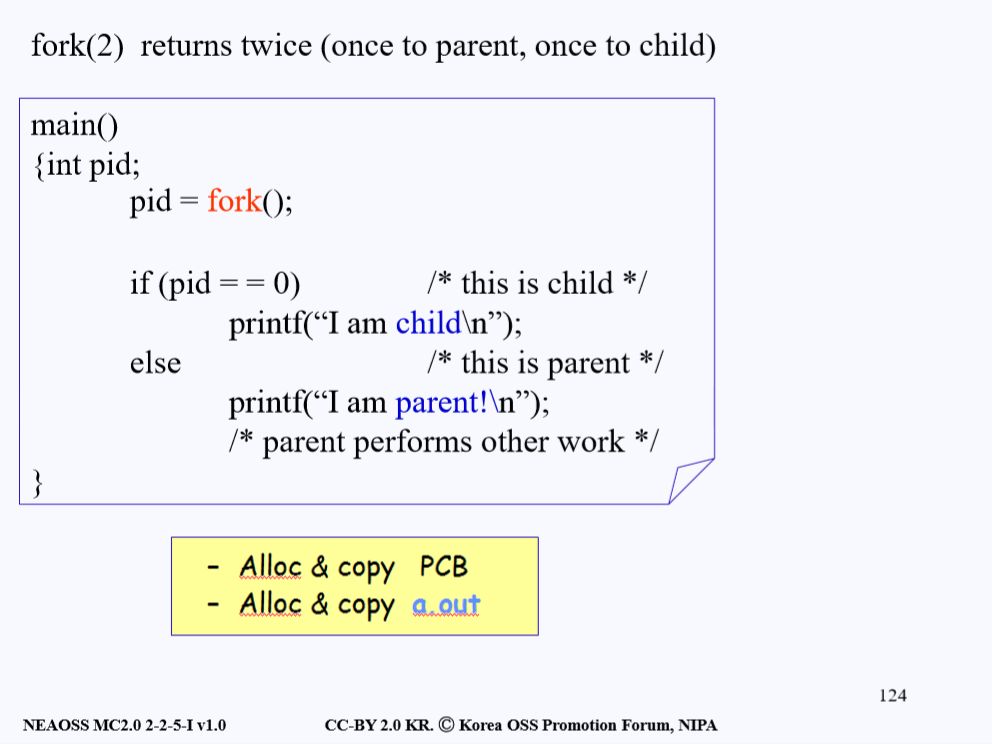

Fork가 두번 리턴되는데 한번은 `Parent Process`로, 한번은 `Child Process`으로 리턴한다. 그리고 리턴할 때의 값은 **pid 값**이다. `pid`는 Process Id라는 의미로 이는 유닉스 시스템에서 각 프로세스에게 할당하는 고유 식별값이다.  `pid`값이  0이라면 가면 `Child Process`를 의미하고 그게 아니라면 현재 실행 중인 프로세스는 `Parent Process`다.

아래의 프로그램을 리뷰하면서 내용을 정리해보자.

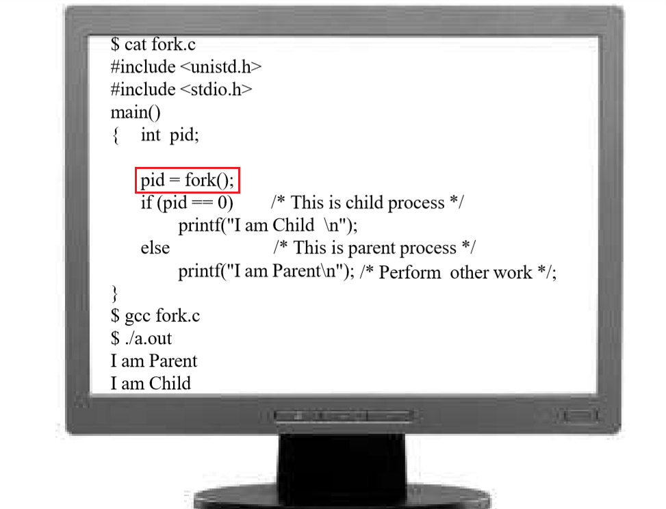

`fork.c`라는 이름을 가진 소스파일이고, fork를 호출하는 프로그램이다. 프로그램의 출력 결과를 예상 해보고 확인하면서 지금까지 배운 `fork`를 리뷰해본다.

`fork()`를 호출하면 위 그림에 나와 있는 코드가 그대로 복사되어 `Child Process`에게 할당된다. **하나 더 생성**이 되는 것이다. 그럼 `Parent Process`와 `Child Process`는 서로 같은 코드와 상태를 가지고 있게 되는 것이다. 

`fork()`호출의 리턴값 `pid`의 값에 따라 `Child Process`가 실행되거나 `Parent Process`가 실행된다. 결국엔 둘 다 실행되겠지만 둘 중 누가먼저 실행되는지 위 코드에서는 정확히 파악하기 어렵다. 보통은 부모 프로세스가 먼저 실행된다.

## 4. 마치며

2장 강의노트를 마친다. 이번 강의에서는 System Call이 일어나는 절차에 대해 System Call Wrapper Routine, System Call Number 등을 배웠고 커널이 프로세스들과 하드웨어들을 관리하기 위해 정보를 모아둔 Data Structure인 metadata에 대해서 배웠다. 또 마지막으로 Child Process의 생성과정 중 Fork에 대해 간략히 알아보았다. 다음 3강에는 Fork를 좀 더 자세히 살펴보고 Exec에 대해 설명한다. 한마디 한마디 중요한 말씀으로 유익한 강의를 제공해주신 고건 교수님께 감사의 말씀 올린다.

