# 4강

이번 4강에서는 `fork()`를 통해 프로세스를 생성해 내는 과정에 대해 더 자세히 알아보는 시간을 갖는다. 또 PCB 내용을 분류해 볼 것이며 `fork()`와는 조금 다른 `clone()`에 대해서도 다룰 예정이다. 이번 강의는 부모 프로세스가 어떻게 자식 프로세스를 어떤 과정을 통해서 만들어 내는지를 확실히 알아야 이해할 수 있기에 먼저 지금까지 배운 내용 중 일부분을 복습을 하고 4강을 진행 할 것이다.

## 1. 복습

지금까지 한 내용들은 아래 등장하는 두개의 그림에 잘 정리 되어있다. 그림에 나와있는 순서들을 머리속에 담아만 둘 수 있다면 앞으로 좀 더 심화적인 내용을 이해할 때 큰 도움이 될 것이다. 그럼 지금부터 그림과 함께 설명을 보도록 하자.

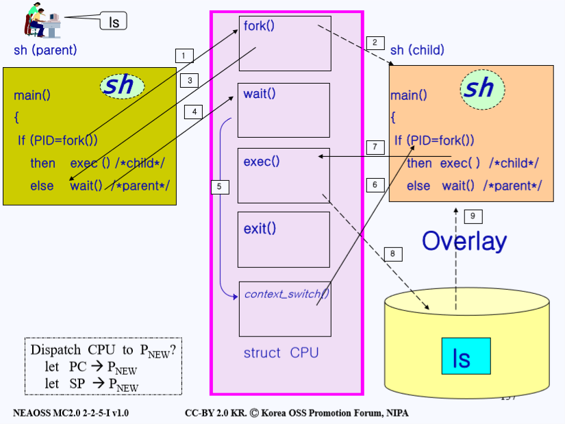

가운데에 보라색 박스로 그려져 있는 커널이 있다. 그리고 좌측에 유저가 작성한 프로그램인 쉘이 있다. 또 여기서 살펴볼 프로세스는 쉘 프로세스로 부모(Parent)와 자식(Child) 두개가 존재한다. 실제로 동작할 때는 훨씬 더 많은 프로세스들이 동작하고 있기 때문에 CPU 자원을 바로바로 받지는 못한다는 점을 알아두고 아래 흐름을 살펴보자.

1. 먼저 우리 프로그램에다 `ls` 명령어를 쳤다고 가정하자. 그러면 프로그램은 `ls`라는 자식 프로세스를 만들려고 할 것이다.
2. 그럼 자식을 만들기 위해 먼저 `fork()`를  실행한다. 이때 이 `fork()`는 쉘에 있는게 아니라 커널안에 있는 것이다. 시스템을 직접적으로 다루는 중요한 동작은 모두 커널이 관리한다. `fork()`는 작성된 프로그램과 똑같은 데이터를 복사해 만들어 줄 것이다. 그림에 표시된 점선은 제어흐름이 넘어간다는 뜻이 아니라 단지 데이터만 복사 된다는 뜻이다.
3. 그렇게 `fork()`를 하고나서 다시 돌아와서 **PID 값**을 비교해 보니 자식 프로세스의 pid값이 리턴되었으므로 현재 부모 프로세스 제어흐름에 있다는 뜻이므로 `else`로 간다. `fork()`는 두번 리턴되는데 한번은 부모 프로세스에게 `fork()`로 만들어진 자식 프로세스의 pid값을 넘겨주고 한번은 자식 프로세스에게 0값을 넘겨준다. 자식 프로세스의 제어 흐름에는 0값이 전달된다. 
4. 이렇게 `else`로 들어온 부모 프로세스는 시스템 콜인 `wait()`을 호출한다. 이때 `wait()`를 한 이유는 부모 프로세스가 **CPU**를 포기하고 자식 프로세스에게 CPU를 넘겨주기 위한 것이다. 즉 실행흐름을 자식 프로세스에게 넘겨주기 위함이다.
5. 그러면 `wait()`에서 CPU를 넘겨주기 위해 `context_switch()`를 실행하면서 지금까지 동작했던 부모 프로세스의 `state vector`들을 부모 프로세스의 `PCB(Process Control Block)`에 저장한다. 그 후 **CPU**를 기다리고 있는 프로세스들의 정보가 있는 `ready queue`에 가서 우선순위가 제일 높은 프로세스의 `PCB`를 **CPU**에 연결 시켜 준다. 
   이때 알아야 할 내용은 커널은 유저마다 **커널 스택**을 하나씩 가지고 있다는 점이다. 현재 커널 스택에는 `wait()`와 관련된 지역 변수들이 먼저 들어가 있다. 그리고 그 위에 `context_switch()`에 관련된 지역 변수들이 저장되어 있다. 부모 프로세스의 `PCB`에는 이러한 정보들이 저장되어 있다.
6. **CPU**를 처음으로 넘겨받은 자식 프로세스는 `return`부터 해야하는 상황에 처해있다. 자식프로세스는 만들어 질때 부모 프로세스의 상태정보를 똑같이 복사해 만들어지기 때문에 `fork()`작업을 마무리 하고 있던 부모프로세스의 상황 또한  그대로 복사 되기 때문이다. 
   그래서 자식 프로세스는 `fork()`로 `return`을 하게 되면서 `fork()`는 두번 리턴한다는 개념이 생겨난 것이다. 단지 이번에는 자식 프로세스의 실행흐름이라는 점이 다르고 리턴된 `pid`값이 0이고 0값을 토대로 `if`와 `else`중 프로그램 내에서 어떤 제어흐름으로 갈지를 결정하게 된다.
7. 리턴된 `pid`값이 0인것을 보면 자식 프로세스라는 뜻이므로 `if`문 안으로 들어가게 된다. 거기서 `exec()`을 하게 된다.
8. 위 그림에서는 `exec()`에 매개변수가 `ls`인 상황이다. 이 명령어는 매개변수로 넘어온 프로그램을 찾고 해당 프로그램 이미지를 로드한다. 따라서  `exec()`이 실행되면서 디스크에 가서 `ls`를 찾는다.
9. 그 후 자식 프로세스쪽에 디스크에서 찾은 `ls`내용을 덮어씌운다. 이로서 자식 프로세스는 더 이상 부모 프로세스의 복제품이 아닌 자신만의 역할을 하는 프로세스로 된다.
   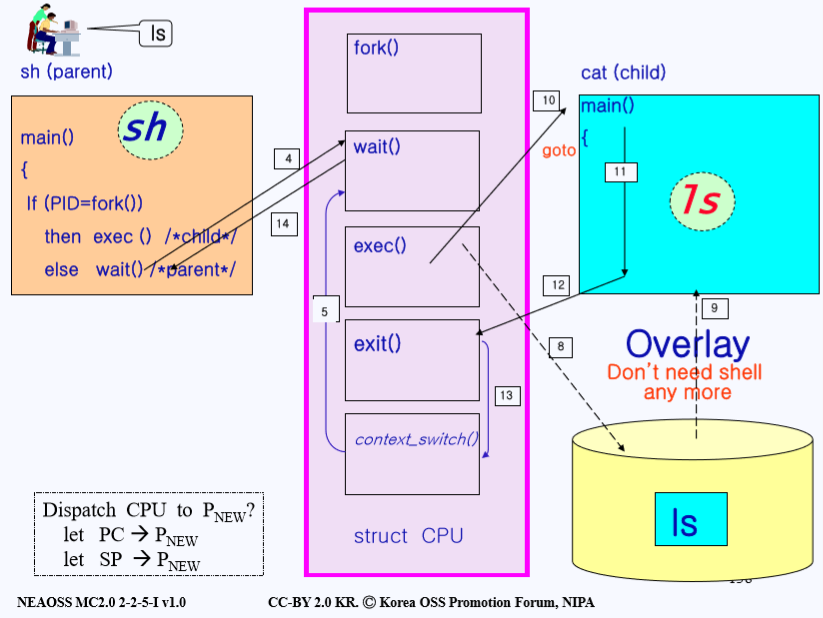

10. `exec()`을 통해 디스크에서 `ls`를 가져와 현재 이미지(코드)에 덮어씌우고
11. 자식 프로세스는 자신이 할 일을 진행한다. 할 일이란 `ls`가 하는 작업과 동일하다.
12. 일을 다 하고나면 이제 CPU가 필요 없으니 프로세스를 종료하기 위해 시스템 콜 `exit()`을 호출한다.
13. 그럼 이제 또 CPU를 다른 프로세스를 주기 위해 `context_switch()`를 하게 되고 이때 부모 프로세스의 PCB를 불러온다. 그럼 이때 커널의 스택에는 `wait()`와 그 위에 `context_switch()`가 쌓여있는 상태로 있다. 보라색 커널 영역의 그림에는 스택이 반대로 표현되어 있다.
    또한 `wait()`과 `context_switch()`사이에 있는 `exec()`과 `exit()`은 중간에 분명 스택에 쌓이긴 했으나 13번 실행흐름 전에 각각 실행이 끝나면서 스택에서 빠져나가 있는 상태다.
14. 마지막으로 스택의 가장 상위에 위치하고 있는 `context_switch()`에서 `wait()`으로, 그리고 `wait()`에서 다시 부모쪽에서 시스템 콜 `wait()`을 호출한 곳으로 돌아가게 된다.

이렇게 하면 `fork()`의 과정이 끝이난다. 복습을 통하여 부모의 프로세스가 어떻게 자식 프로세스를 생성하고 자식 프로세스는 어떻게 종료되는지에 대해 알아보았다. 그렇다면 이제 본격적으로 `fork()`를 통해 프로세스를 생성하는 과정을 자세히 알아보자.

## 2. Process Create

부모 프로세스가 자식 프로세스를 만들어 내는 작업을 할 때는 두번의 오버헤드(overhead)가 발생한다. 이 오버헤드들은 `fork()`를 하는 도중 발생하며, 첫번째 오버헤드는 부모 프로세스의 이미지를 자식에게 복사할 때 생기고 두번째는 부모 프로세스의 PCB를 자식 프로세스에 복사하며 생긴다.

작업 과정을 자세히 알아보기 전에 먼저 PCB의 구성에 대해 알아보자.

> 오버헤드: 어떤 처리를 하기 위해 들어가는 간접적인 처리 시간, 메모리 등을 말한다.
>
> A라는 처리를 10초만에 했지만 안전성 고려 때문에 처리가 15초가 걸리는 B의 방식은 오버헤드가 5초가 발생한 것이다. 또한 이러한 B의 방식을 개선해 12초가 걸리면 오버헤드가 3초 단축되었다고 말한다.

### 2.1 리눅스의 PCB와 Thread

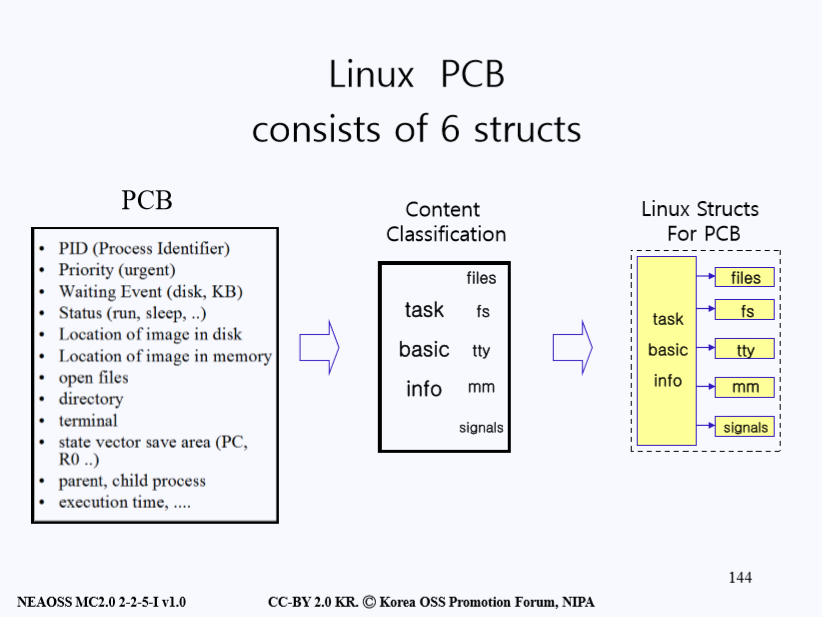

PCB에는 다양한 정보들이 수 킬로바이트라는 꽤 큰 용량으로 구성되어 있다. 이러한 PCB의 내용을 분류를 하자면 **task basic info**와 프로세스가 오픈한 파일들에 대한 정보가 들어있는 **file**, 프로세스가 접근 중인 file system에 대한 정보인 **fs**가 있으며 프로세스가 사용 중인 터미널 정보 **tty, **사용 중인 메인 메모리에 대한 정보 **mm**과 여러 신호 정보인 **signals**들로 나눌 수 있다.

리눅스는 이렇게 분류된 요소들을 하나의 구조(Struct)로 묶지 않고 그림 오른쪽에 나와 있는 것 처럼 **6개의 구조**로 나눠 관리한다.

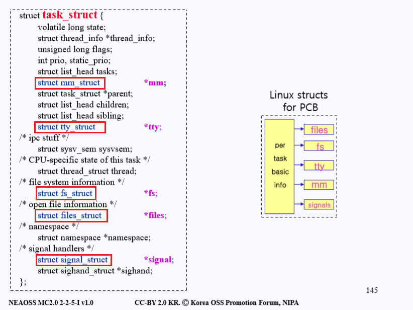

먼저 그림의 왼쪽 상자에 나와있는 것처럼 크게 `task_struct`가 있다. 이건 리눅스가 가지고 있는 `PCB`인데 그 안에는 여러개의 `struct`들에 대한 내용이 있고 그 옆에 보라색으로 `*mm, *tty등`이 있는 것을 알 수 있다. 보라색으로 표시되어 있는 **포인터(*)**를 따라가면 각각이 가르키는 파일, 메모리를 등을 만나볼 수 있다. 이는 오른쪽 그림에도 나와있는데, 그림을 보면 왼쪽 노란 상자에 `task basic info`가 있고 그곳에서 화살표로 가르키는 곳을 따라가면 각각의 구조(struct)들이 나온다. 이처럼 **리눅스의 PCB**는**1개의 구조가 아닌 6개**의 구조로 나눠져 있다.

그렇다면 리눅스는 어째서 1개가 아닌 6개로 나눠서 관리하는 것일까.

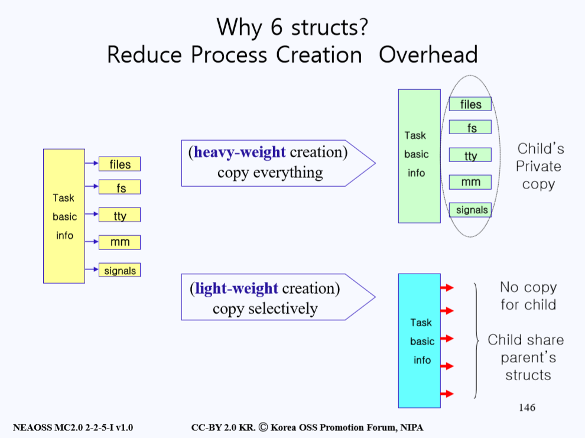

위 그림의 왼쪽에 있는 노란 상자들을 보자. **저 6개의 상자들이 있어야 하나의 PCB**이다. 전에 `fork()`를 통해 자식 프로세스를 생성하고 이때 부모 프로세스의 정보를 그대로 복사한다고 했는데 그 정보가 바로 위 그림에 나와 있는 정보다.

그렇다면 부모 프로세스의 노란색 상자 6개 구성요소가 전부 자식 프로세스에게 복사되는 것일까? 만약 그렇게 `fork()`가 동작한다면 `files, fs, tty, mm, signals` 등을 각각 읽고 쓰는데 많은 자원이 사용된다. **모든 걸 복사**해서 자식 프로세스를 만든다고 했을 때 부모 프로세스의 PCB 정보를 `read()`할 때 사용되는 바이트, 자식 프로세스의 PCB에 `write()`할 때 필요한 바이트가 각각 필요하므로 상당한 부하가 걸린다. 따라서 이러한 제작 방식을 **heavy-weight creation**이라 칭한다. 초기 리눅스가 구현될 때는 이런 방식으로 구현되었다고 한다.

그러나 막상 시스템을 만들다보니 부모 프로세스가 가지고 있는 `tty(터미널)`나 `fs(파일 시스템)`는 자식이 가지고 있는 것과 동일한 경우가 많다. 즉 복사하는 게 아니라 공유를 할 수 있다. 자식 프로세스에게는 부모 프로세스가 가지고 있는 `tty`나 `fs`등의 주소만 알려줘서 같은 자원을 공유하는 방식으로 생성되는 것을 **light-weight creation **칭한다. 

자식 프로세스가 부모 프로세스와 다르게 사용할 것들만 **선택적으로 복사**하자라는 아이디어로 구현한 이 방식은 전부 복사할 때 들어가는 하드웨어 자원과 오버헤드를 최소화 시키는 장점이 있다.

자, 그럼 위에서 배운 개념을 바탕으로 좀 더 구체적인 예시를 들고 이해해보자. 게임을 만든다는 상황을 가정해보자.

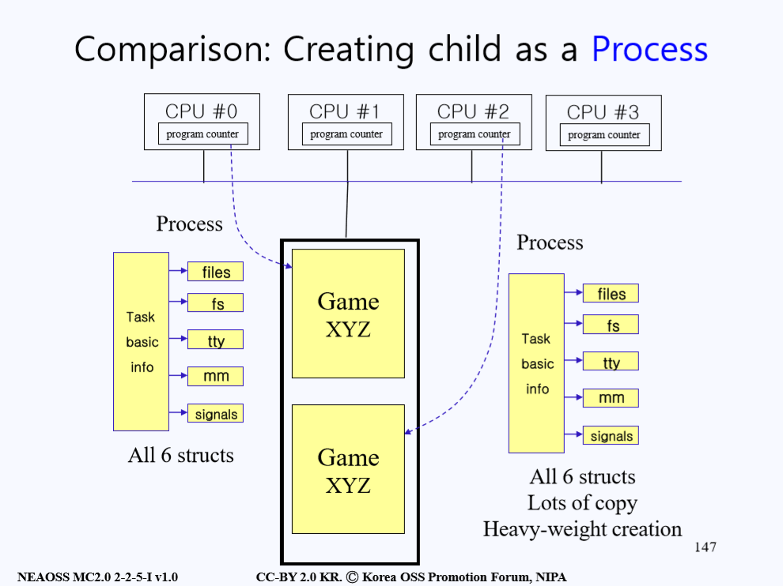

위 그림을 보면 정 가운데에 검은 네모 상자는 메인 메모리를 뜻한다. 맨 위의 박스들은 여러개의 CPU를 표현하고 있고 CPU마다 각각 프로그램 카운터를 내장하고 있다. 이런 상황에서 `Game XYZ`가 실행되고 있다고 가정하자. 이 게임은 지금 `CPU #0`위에서 실행되고 있고 `Game XYZ` 프로세스를 `CPU #0`의 `PC(프로그램 카운터)`가 가르키고 있다. 그리고 각 `CPU`를 위해서 `PCB`가 좌측에 노란 상자로 존재하고 있다. 각 `PCB`는 6개의 구성요소로 되어 있다.

이런 상황에서 자식 프로세스를 전통적인 방법으로 만들었다고 생각해 보자. 그럼 `a.out`도 복사하고 `PCB`도 똑같이 복사해서 자식 프로세스를 만들 것이다. 이렇게 되면 위에서 말했던 것처럼 오버헤드가 발생한다. 어떻게 하면 오버헤드를 줄여줄 수 있을까?

> **프로그램 카운터**(Program counter,**PC**): 마이크로프로세(중앙 처리 장) 내부에 있는 레지스터 중의 하나로서, 다음에 실행될 명령어의 주소를 가지고 있어 실행할 기계어 코드의 위치를 지정한다. 때문에 **명령어 포인터 **라고도 한다.
>
> **프로세서 레지스터**(Processor Register): 컴퓨터의 프로세서 안에서 자료를 보관하는 아주 빠른 기억 장소이다. 일반적으로 현재 계산을 수행중인 값을 저장하는 데 사용된다.
>
> **a.out**: 과거 유닉스 계통 운영 체제에서 사용하던**실행 파일**과**목적 파일**형식. assembler out의 약자이다.

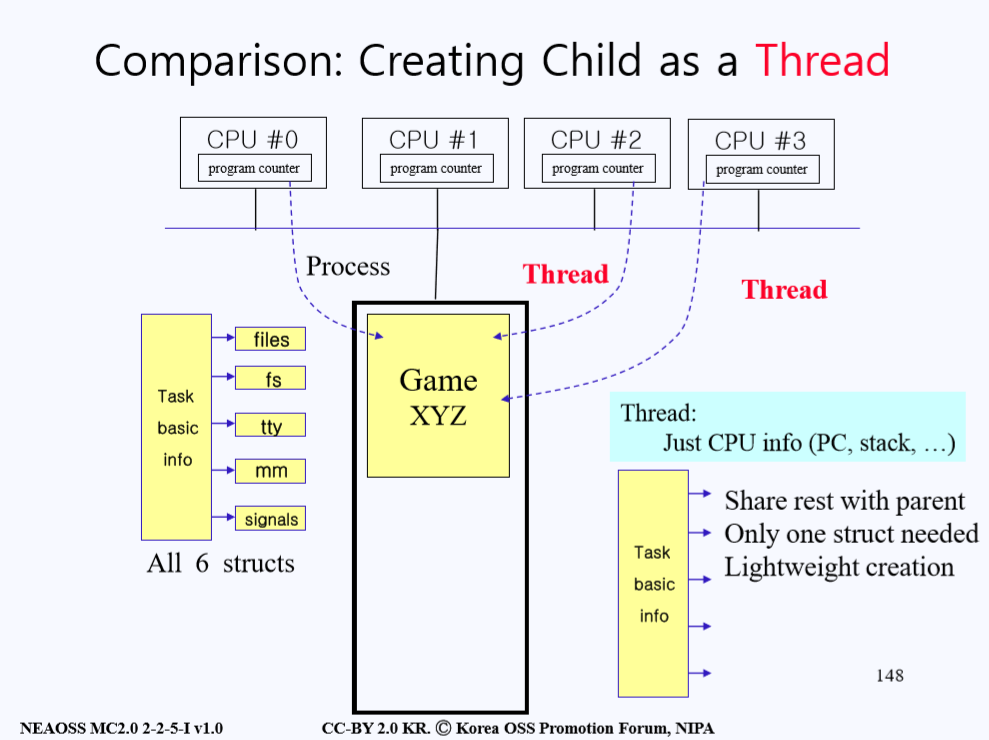

오버헤드를 줄이기 위해 고안된 방법이 바로 자식 프로세스를 생성할 때 프로세스로 만들지 않고 **Thread**로 만드는 것이다. **Thread**는 모든 구조를 복사해 오는게 아니라 **CPU관련 정보들을 가지고 있는 Task basic info만 복사해 오는것을 칭한다.** 아래 그림을 보면 자식들은 부모의 구조들을 전부 복사해오지 않고 **Task basic info**만 복사해 와서 나머지는 부모와 공유해 사용한다. 이러한 방식을 light-weight creation이라고 한다.

> **프로세스와 스레드의 차이**: 프로세스는 운영 체제로부터**자원을 할당**받는 작업의 단위이고 스레드는 프로세스가 할당받은**자원을 이용**하는 실행의 단위이다.

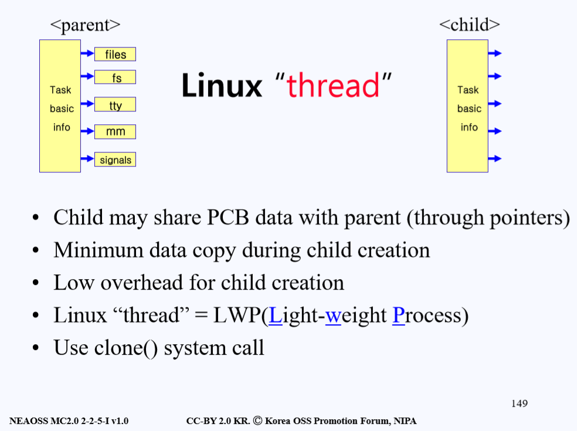

위의 내용들을 정리해보면, 리눅스에서 **Thread**는 `PCB`에서 **Task basic info만 복사**해오고 다른 PCB 데이터는 **공유**를 한다. 덕분에 데이터의 복사는 줄고 자식 프로세스를 만들때의 오버 헤드가 최소화 된다. 그래서 리눅스에서의 **Thread**라는 것은 프로세스를 만들때 **light-weight 방식**으로 만든다고 한다. 그리고 이런 방식은 단순히 복사를 하는 `fork()`가 아닌 **`clone()`**이라는 시스템 콜을 사용한다.

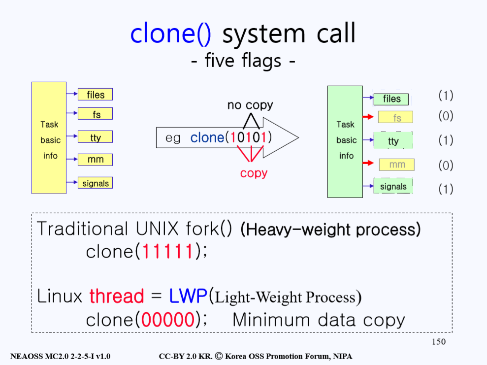

`clone()` 시스템 콜을 살펴보기 위해 위의 그림을 살펴보자. 가운데 `clone()` 시스템 콜이 있다. `clone()`을 호출할 때 부모 프로세스는 바이너리 비트 5개를 매개변수로 넘긴다. 만약 **이 5개의 비트가 전부 11111이면 모든걸 복사하고 00000이면 Task basic info만 복사해오는 제일 light-weight 복사 방식을 하라는 것을 뜻한다.** 이러한 방식으로 생성된 자식 프로세스는 프로세스라 하지 않고 **Thread(스레드)** 칭한다.

여기서 만약 `clone()`의 **바이너리 비트 5개가 clone(11111)이면 모든 걸 복사하는 전통적인 heavy-weight 방식인 fork()를 해달라는 의미와 같은 뜻이 된다.** 이렇게 생성된 자식 프로세스는 프로세스가 된다.

> Unlike fork(2), these calls allow the child process to share parts of its execution context with the calling process.

## 3. Process Copy

지금까지는 프로세스가 생성 되는 과정에 대해서 알아보았다. 부모 프로세스가 자식 프로세스를 생성 할 때 두가지 오버 헤드가 생긴다는 것을 배웠다. **첫번째는 PCB를 복사할 때 생기고 두번째는 image를 복사 할 때 생긴다.** **PCB는 하얀색 도화지의 속성(크기, 질감, 모양)이라면 image는 그 도화지 위에 색칠된 그림이라고 볼 수 있다.** 그렇기에 PCB보다는 **image를 복사해 오는 오버 헤드가 더 크게 발생한다.**

부모 프로세스한테 `ls`를 명령하면 바로 자식 프로세스가 자신만의 속성을 갖고 생성되는 것이 아니라, 먼저 부모 프로세스의 상태 정보를 복사하고 그 위에 자식 프로세스가 갖는 속성을 덮어 씌운다. 근데 생각해보면 이런 과정 자체가 너무 비효율적인 과정이라고 생각 할 수도 있다. **어차피 덮어씌울 걸 왜 굳이 부모의 image까지 복사하는 과정이 필요한 것일까.**

물론 위와 같은 완전한 복사가 항상 비효율적이라는 것은 아니다. 어떤 유저는 부모 프로세스가 가지고 있던걸 정확히 똑같이 복사하고 싶어할 수도 있다. 예를 들어 hwp 문서를 키고 또 똑같은 hwp 문서를 새로 키고 싶어하는 경우도 있을 수 있기 때문이다. 그러나 대부분은 이메일을 키고 거기서 이메일을 쓰는 일을 하듯이 부모 프로세스와는 다른 일 처리를 하는 경우가 대부분이다.

그래서 고안된 아이디어는 다음과 같다. 모든 코드를 복사해 오는 것이 아니라 **페이지 매핑 테이블만 복사**해 오는 방법이다. 이 방법을 사용하면 **자식 프로세스는 image를 부모 프로세스로부터 가져오는 것이 아니라 부모 프로세스의 image를 가르키는 페이지 매핑 테이블만 복사해서 가져오게 된다.** 자식 프로세스는 페이지 매핑 테이블을 가지고 execute를 하게 되고 Instruction(실행 명령)을 가져오는 동안에는 부모와 **같은 페이지**를 쓸 수 있게 된다.

> **페이지 테이블**: 페이징 기법에 사용되는 자료구조로서, 프로세스의 페이지 정보를 저장하고 있는 테이블이다. 테이블 내용은 해당 페이지에 할당된 물리 메모리의 시작 주소를 담고있다.
>
> **페이징 기법**: 컴퓨터가 메인 메모리에서 사용하기 위해 2차 기억 장로부터 데이터를 저장하고 검색하는 메모리 관리 기법

그런데 이렇게 같은 페이지를 사용하다 보면 문제가 생기는 경우가 발생한다. 자식과 부모 프로세스 둘 다 페이지에서 `read()`해서 데이터를 읽는건 상관이 없지만, 만약 페이지에 **write()**를 해서 무언가를 페이지에 쓰게 된다면 어떻게 될까. 

`write()`를 하는 경우에만 한정해서 그 **페이지만 부모와 자식에게 하나씩 복사**본을 따로 만들어 주면 된다. 이런 과정을 **Copy on Write(COW)**라고 부른다. 아래 그림을 살펴보자.

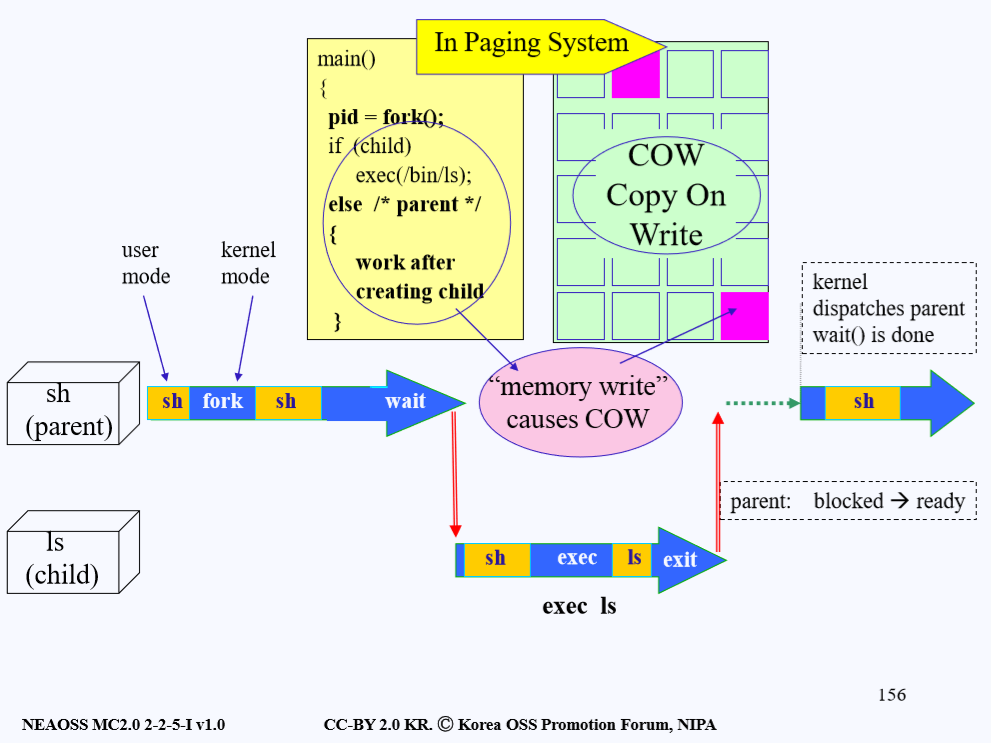

**Copy On Write**방식을 이용하면 처음 시작할 때 자식 프로세스는 페이지 테이블만 가지고 있을뿐 독자적인 image라는 것은 없다. **그러나 부모나 자식 프로세스중 하나라도 페이지에 변화를 주면 그 부분만 각각 복사를 하게 된다.** 이런 방식은 image를 약간은 게으르게(lazy) 만들어 주는 방식으로 볼 수도 있을 것이다.

위 그림을 보면서 다음 설명을 같이 따라가 보자. 먼저 부모 프로세스쪽에서 `fork()`를 하게 된다. 부모 프로세스 정보를 전부 복사 하는 것이 아니라 **COW 방식으로 페이지 테이블만 복사해 가져온다.** 그리고 나서 `fork()`를 했던 곳으로 돌아온다. 그리고 나서 `wait()`시스템 콜을 호출해서 CPU를 자식 프로세스에게 넘겨주려 할 것이다. 그럼 CPU가 자식 프로세스에게 넘어가서 자식도 `fork()`로부터 리턴해서 자식 프로세스만의 작업들을 수행할 것이다. 이때 자식이 페이지를 읽어 오는건 상관없지만 **write()를 하게 되면 그 페이지에 대해서만 복사를 한다.**

그런데 보통 자식 프로세스는 `fork()`에서 돌아오면 거의 바로 `exec()`을 하게 된다. 즉 전에 부모 프로세스의 이미지를 복사 했든 안했든 자신만의 이미지(코드)로 싹 갈아엎는다. 여기서 문제가 발생하는데, 부모 프로세스가 `fork()`를 하고나서 돌아오고 나서 문제가 생긴다. 부모 프로세스가 `fork()`에서 돌아와서**바로 wait()를 안하고 다른 일을 처리할 경우 3분의 1 정도는 보통 write()의 기능을 한다.** 그 말인 즉슨 자식 프로세스가 CPU를 점유하기 전에 페이지 테이블에 계속 변화가 발생하게 되는 것이다.

이런 행위는 계속해서 **Copy On Write**를 하게 될 것이고 **이렇게 복사 된 값들은 사실 자식 프로세스가 exec()을 하게 되면 어차피 덮어 씌워지기 때문에 결국에는 의미없는 복사를 하고 있는게 된다.** 그렇다면 어떻게 하는 것이 효율적인 방법일까. 아래 그림을 살펴보자.

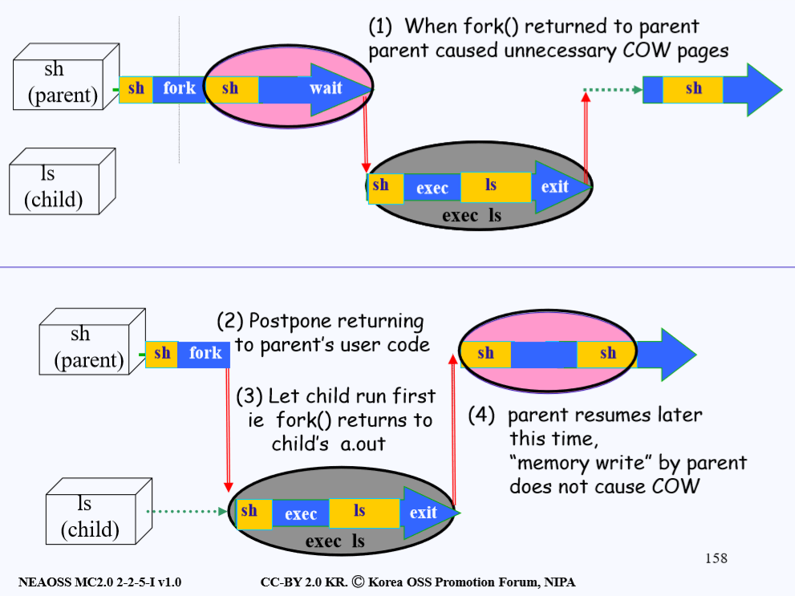

**그림의 위쪽 부분은 위에서 설명한 불필요한 COW가 발생하는 경우를 나타낸 것이다.** `fork()`로 돌아온 부모 프로세스가 자식 프로세스에게 `wait()`으로 CPU를 넘겨줄 때 까지 계속해서 의미없는 COW를 만들어 내고 있는 그림이다.

이를 해결하기 위해서 다음과 같은 새로운 방법을 사용한다.

1. 부모 프로세스가 `fork()`를 호출해서 자식 생성을 끝내고 `fork()`를 했던 곳으로 돌아가려 한다. 즉 커널에서 유저모드로 돌아가려 하고 있다.
2. 이때 `fork()`안에서 **자식 프로세스의 CPU 우선 순위를 확 높여버린다.** 이렇게 우선순위를 높이는 이유는 커널에서 유저모드로 돌아갈때에는 우선순위가 제일 높은 프로세스한테 CPU를 넘겨주기 때문이다.
3. **이렇게 되면 CPU가 부모한테 돌아가는 것이 아니라 자식 프로세스한테 가게 된다.** 이렇게 CPU를 받은 자식 프로세스는 바로 `exec()`을 하게 되고 CPU를 다 쓰게 되면 `exit()`으로 CPU를 다음 순서로 넘겨주게 된다.
4. 그럼 이제 부모 프로세스가 CPU를 받게되고 `fork()`에서 돌아오고 본인이 할 일을 하게된다.

**이러한 방식을 통해 쓸데없이 일어나는 COW를 방지하고 자식 프로세스는 성공적으로 복사된다.**

## 4. 마치며

4강에서 핵심을 뽑자면 아래의 2가지를 꼽을 수 있겠다.

1. 리눅스가 PCB를 6개의 구조로 나누어서 관리한다는 것과 PCB를 전부 복사하지 않고 필요한 것들만 복사하는 것을 **Thread(Light Weight Creation)**라고 한다는 점.

2. 복사한 페이징 매핑 테이블의 불필요한 Copy On Write를 방지하기 위해 `fork()`에서 돌아올때 부모가 아닌 자식에게 먼저 CPU를 줘 오버 헤드를 막는점. 

   고건 교수님께서 친절하게 `fork()`의 과정까지 복습을 해주시고 나서 심화 내용을 들어가 차근차근 이해하기 쉽게 강의를 따라갈 수 있었던 것 같다.

