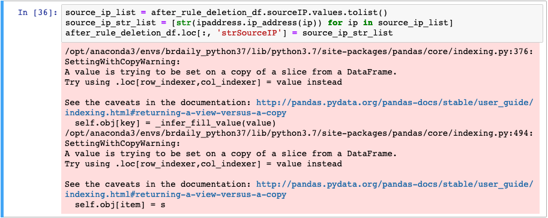
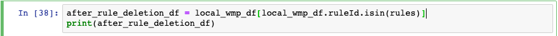

# SettingWithCopyWarning 해결과정

회사에서 사용 중인 파이썬 스크립트를 분석할 일이 생겨 분석하던 중 다음과 같은 경고문을 만났다.

이 에러가 나에게 하고 싶은 말은 ***"당신이 지금 하는 작업들이 어떤 DataFrame에 대한 작업인지 모르겠어! 의도치 않은 결과를 초래할 수도 있으니 조심해."***이다. 

도대체 왜 이런 문구가 떴는지를 이해하려면 위 스크린샷 전에 있던 셀을 함께 살펴봐야한다. 아래 사진을 살펴보면,

`local_wmp_df` 라는 DataFrame에 특정 조건을 만족하는 로우들만 담아오기 위해 38번 라인을 적었다.

결론은 DataFrame을 다룰 때는 copy를 다루는 것인지 아니면 원본을 다루는 것인지를 항상 명시적으로 기입해줘야 한다.

원본 DataFrame을 변경시키는 연산이라면 옵션 중에 `inplace=True` 옵션을 꼭 사용해줘야 하고 복사본을 다루고 싶다면 `.copy()` 연산자를 사용해서 복사를 한다는 걸 명시해줘야 한다.

