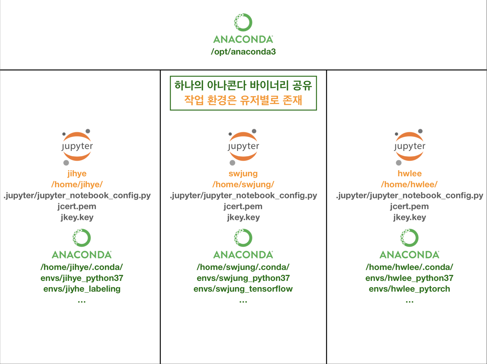
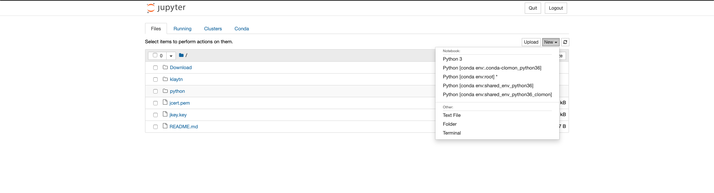

# 하나의 서버에서 여러 유저가 협업 가능한 무료 파이썬 개발 환경 구축하기 (Anaconda + JupyterNotebook)

**서버 정보:**

* **OS:** CentOS Linux release 7.6.1810
* **Anaconda:** 4.7.11
  * 설치된 경로: `/opt/anaconda3`
* **Management**
  * 계정에 대한 정보
    이번 포스팅에서는 서버 내에 root를 함한 유저가 총 5명이 있다고 가정한다.
    각자 원하는 환경에 맞춰 `useradd` 커맨드로 유저를 생성해주면 된다.
  * 표기 정보: <user> | <group>
    * root
    * anaconda | anaconda
    * jihye | pydev
    * swjung | pydev
    * hwlee | pydev


**대상 독자:** 하나의 서버에 여러 명의 동료들과 협업할 수 있는 파이썬 개발환경 구축이 필요한 독자.

> 예시: 파이썬을 개발하는 모임 혹은 단체에서 클라우드 서비스에서 서버를 하나 구입하고(예를 들면 AWS의 EC2 instance), 그 서버로 모임 내의 모든 유저가 자유롭게 개발하고 공유할 수 있는 환경 구축을 원할 때 사용할 수 있는 아키텍처다.


## 1. Architecture Overview

아나콘다를 설치할 때 특정 유저의 하위 디렉토리에 두는 것이 아니라 모든 유저가 사용할 수 있는 공통의 위치에 둔다. 예를 들면 `/opt/anaconda3`와 같은 곳에 말이다.

그리고 모든 유저들은 `/opt/anaconda3`에 있는 아나콘다 바이너리를 공유하고, 개인 작업 환경은 분리하여 구성한다. 아래 그림을 보면 각 유저별로 `/home/<user>/.conda/envs/` 아래에 자신만의 환경이 만들어져 있다.

향후 환경을 공유하고 싶다면, 공유를 원하는 아나콘도 환경 파일을 `.yml` 파일로 추출한뒤 아나콘다 클라우드에서 공유하거나 아나콘다 관련 모든 환경을 관리하는 `anaconda` 계정에서 해당 `.yml` 파일을 import하여 모든 유저가 사용가능하게 설정할 수 있다.




## 2. Install Anacodna

아나콘다 공식 다운로드 홈페이지에 가서 CLI-installer에 해당하는 링크를 복사하여 `curl <install_script_link>` 처럼 입력하여 서버 쉘에서 작업해주는 것으로 설치과정은 시작된다. 아래 과정을 참고하여 설치하도록 한다.

설치 과정은 `root` 계정으로 진행하도록 한다.

```bash
root/$ curl https://repo.anaconda.com/archive/Anaconda3-2019.07-Linux-x86_64.sh --output Anaconda3-2019.07-Linux-x86_64.sh
root/$ chmod +x Anaconda3-2019.07-Linux-x86_64.sh
root/$ ./Anaconda3-2019.07-Linux-x86_64.sh
root/$ adduser anaconda # 아나콘다 관련 작업은 이 계정이 담당한다.
# 설치 과정 진행중 ...
# 진행 중 어떤 위치에 설치할 것인지를 묻는 질의가 나오는데 /opt/anaconda3처럼 /opt 하위 경로에 설정
# 설치가 끝나면 /root/.bashrc에 아나콘다 관련 스크립트가 추가된다.
modified      /root/.bashrc

==> For changes to take effect, close and re-open your current shell. <==

If you'd prefer that conda's base environment not be activated on startup,
   set the auto_activate_base parameter to false:

conda config --set auto_activate_base false

Thank you for installing Anaconda3!

```


### 2.1 anaconda유저에게 관리 권한 부여

공통으로 사용하는 서버이다 보니 관리자 계정 anaconda를 별도로 두고 `/opt/anaconda3`디렉토리 사용 권한을 전적으로 위임한다. 

```bash
# 아나콘다 관련 권한은 아나콘다 유저에게
root/$ chown -R anaconda:anaconda /opt/anaconda3
# webdev 계정을 아나콘다 그룹에 추가
usermod -a -G anaconda webdev

# anaconda계정에서 작업
root/$ su - anaconda
# 쓰기 권한은 아나콘다 유저에게만 할당해주고 나머지 유저들은 읽고 실행만할 수 있게끔 설정한다. 
/home/anaconda/$ chmod -R go-w /opt/anaconda3/
/home/anaconda/$ chmod -R go+rX /opt/anaconda3/

```


### 2.2 nb_conda + ipykernel

아나콘다에서 생성한 환경을 Jupyer Notebook 인터페이스에서 확인하고 작업할 수 있게끔 도와주는 라이브러리들이다.

base 환경에서 다음과 같이 `nb_conda` 를 설치해주고 이후 새로운 환경을 생성할 때 `ipykernel` 라이브러리를 항시 포함해주도록 한다.

참고로 anaconda계정에서 생성하는 환경은 모든 유저들이 공유할 수 있다. 그래서 환경 이름을 정해줄 때는 `shared_` prefix를 추가해주는 것이 좋다.

```bash
# 아나콘다 파이썬 개발환경 기본 설정
(base) /home/anaconda/$ conda install nb_conda # 주피터 노트북 환경을 위해 설치
(base) /home/anaconda/$ conda create --name shared_env_python36 python=3.6 ipykernel
```

여기까지 진행했다면 아나콘다 관련 기본 설정은 모두 마친 것이다.


## 3. Setup Jupyter Notebook For Each User

anaconda계정 포함 각 유저별로 한 번만 설정해주는 설정이다. `hwlee`계정에서 설정하는 시나리오를 살펴보자.

### 3.1 Create config & generate password hash

Jupyter Notebook은 서버-클라이언트 구조의 웹 서버 애플리케이션이다. 브라우저에서 실행되며 기본적인 로그인 기능도 갖추고 있다.

아래 설정은 Jupyer Notebook Server를 운영할 때 각종 설정값을 조절할 수 있는 설정 파일과 로그인할 때 사용할 비밀번호를 설정하는 단계다. 

비밀번호를 입력하고 로그인하면 서버에서는 해당 비밀번호 값을 그대로 비교하는 것이 아닌 비밀번호의 해시와 비교하게 된다.

> 이는 매우 널리 사용되고 있는 구조다. 유저의 비밀번호를 그대로 저장하는 온라인 회사는 거의 없다고 보면 된다. 개인정보 보호는 매우 중요하다.

```python
# This command will create a default Jupyter Notebook configruation file: /home/hwlee/.jupyter/jupyter_notebook_config.py
(base) hwlee@Cloud4SECaaS:~$ jupyter notebook --generate-config

# For security purpose, use the following commands to setup a password for JupyterNotebook server:
(base) hwlee@Cloud4SECaaS:~$ python
Python 3.7.3 (default, Mar 27 2019, 22:11:17)
[GCC 7.3.0] :: Anaconda, Inc. on linux
Type "help", "copyright", "credits" or "license" for more information.
>>> from notebook.auth import passwd
>>> passwd()
Enter password: hwlee
Verify password: hwlee
'sha1:a487d4efd689:6660d78a1515ae2313544fdc5432e44ae51162ab'
>>> Ctrl+c
```


### 3.2 HTTPS 통신을 위한 설정

Jupyter Notebook 서버와 HTTPS로 통신하기 위해 인증서를 발행한다.

```bash
(base) hwlee@Cloud4SECaaS:~$ openssl req -x509 -nodes -days 365 -newkey rsa:4096 -keyout jkey.key -out jcert.pem
Generating a RSA private key
.......................................................++++
.........++++
writing new private key to 'jkey.key'
-----
You are about to be asked to enter information that will be incorporated
into your certificate request.
What you are about to enter is what is called a Distinguished Name or a DN.
There are quite a few fields but you can leave some blank
For some fields there will be a default value,
If you enter '.', the field will be left blank.
----- # 아래의 세부 사항은 귀찮으면 생략하셔도 크게 문제 없다.
Country Name (2 letter code) [AU]:KR
State or Province Name (full name) [Some-State]:
Locality Name (eg, city) []:Seoul
Organization Name (eg, company) [Internet Widgits Pty Ltd]:Cloudbric
Organizational Unit Name (eg, section) []:development
Common Name (e.g. server FQDN or YOUR name) []:cloudbric_hwlee
Email Address []:cloudbric@cloudbric.com
```


### 3.3 통신 포트 설정

```bash
(base) hwlee@Cloud4SECaaS:~$ vi .jupyter/jupyter_notebook_config.py
# Set options for certfile, ip, password, and toggle off
# browser auto-opening
c.NotebookApp.certfile = '/home/hwlee/jcert.pem'
c.NotebookApp.keyfile = '/home/hwlee/jkey.key'
# Set ip to '*' to bind on all interfaces (ips) for the public server
c.NotebookApp.ip = '*'
c.NotebookApp.password = 'sha1:a487d4efd689:6660d78a1515ae2313544fdc5432e44ae51162ab'
c.NotebookApp.open_browser = 'False'

# iptables룰을 보면, 9995~9999포트가 허용되어 있고 각 유저의 .jupyter/jupyter_notebook_config.py의 
# port 부분을 확인해서 사용되지 않는 포트를 지정한다. 현재 포트 사용 현황은 다음과 같다.
# port | user_name
# 9999: anaconda
# 9998: hwlee
# 9997: jihye
# 9996: swjung
# 9995: <None>
c.NotebookApp.port = 9998
```

포트 번호가 중복되지 않게 각 유저별로 다른 포트를 설정해둔다.


## 4. Run Jupyter Notebook

설정이 끝난 이후 Jupyer Notebook Server를 실행하고 접속해본다. 처음 접속할 때 경고창이 나온다면 그대로 진행을 하면 된다.

New 버튼을 눌렀을 때 생성한 아나콘다 환경들이 잘 보이는 것을 확인할 수 있고 각 환경별로 작업할 수 있다.



